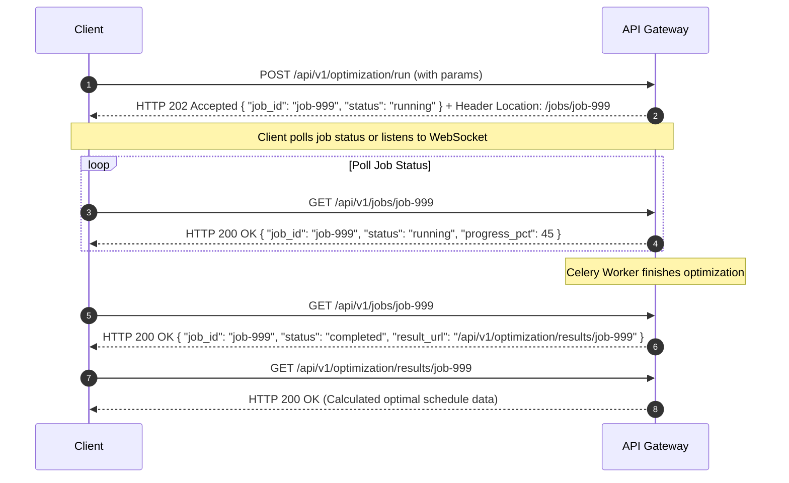

# Спецификация REST API (API Design Document) платформы SmartBESS
## Автор: Lead API Architect

---

## 1. Конвенции REST API и стратегии проектирования

### 1.1. Базовые принципы
*   **Формат обмена данными**: Исключительно JSON (`Content-Type: application/json`).
*   **Регистр полей**: `snake_case` для всех ключей JSON (как в запросах, так и в ответах).
*   **Формат времени**: Строгий стандарт ISO 8601 с указанием временной зоны (`YYYY-MM-DDTHH:MM:SSZ` или `YYYY-MM-DDTHH:MM:SS+HH:MM`).
*   **Идемпотентность**: Для мутирующих POST-запросов (например, запуск расчетов) поддерживается заголовок `Idempotency-Key` (UUIDv4) для предотвращения повторной отправки одной и той же транзакции при сетевых сбоях.

### 1.2. Коды ответов HTTP
*   `200 OK` — Успешное выполнение синхронного запроса.
*   `201 Created` — Успешное создание ресурса (например, добавление BESS-актива).
*   `202 Accepted` — Запрос принят на обработку, но задача выполняется асинхронно (длительные расчеты ML или MILP). Возвращает ссылку на опрос статуса задачи в заголовке `Location`.
*   `400 Bad Request` — Ошибка синтаксиса запроса.
*   `401 Unauthorized` — Токен отсутствует или невалиден.
*   `403 Forbidden` — Токен валиден, но у пользователя нет прав на этот ресурс (RBAC ошибка).
*   `404 Not Found` — Ресурс не найден.
*   `422 Unprocessable Entity` — Ошибка валидации параметров схемы (например, некорректная емкость батареи или дата).
*   `500 Internal Server Error` — Системная ошибка бэкенда.

---

## 2. Стратегия версионирования (Versioning Strategy)

Платформа использует **URL-версионирование** как наиболее прозрачный и кэшируемый способ для B2B/B2G интеграций:
$$\text{URL format: } https://api.smartbess.ua/api/v1/...$$

*   **v1 (Текущая версия)**: Базовый функционал прогнозирования, оптимизации и SCADA.
*   **Обратная совместимость**: Минорные изменения (добавление необязательных полей в JSON-ответах) происходят без изменения мажорной версии.
*   **Мажорное версионирование (v2)**: Вводится только при ломающих изменениях (изменение типов обязательных полей, удаление эндпоинтов).

---

## 3. Асинхронная модель выполнения задач (Async Job Model)

Для эндпоинтов с длительным временем выполнения (`POST /forecast/run`, `POST /optimization/run`, `POST /scenarios/payback`) применяется паттерн **Asynchronous Job Queue**:



---

## 4. Таблицы OpenAPI спецификаций по группам

### 4.1. Группа `auth` (Аутентификация)

| Эндпоинт | Метод | Описание | Заголовок Auth | Валидация |
| :--- | :--- | :--- | :--- | :--- |
| `/api/v1/auth/login` | `POST` | Получение JWT пары токенов (access/refresh) | None | Email формат, пароль $\ge 8$ символов |
| `/api/v1/auth/refresh` | `POST` | Обновление протухшего access-токена | None | Refresh token UUID/JWT |
| `/api/v1/auth/logout` | `POST` | Отзыв refresh-токена и выход из сессии | Bearer Access | None |

### 4.2. Группа `assets` (Управление BESS-активами)

| Эндпоинт | Метод | Описание | Заголовок Auth | Валидация |
| :--- | :--- | :--- | :--- | :--- |
| `/api/v1/assets` | `GET` | Получение списка всех BESS активов организации | Bearer (Viewer+) | None |
| `/api/v1/assets` | `POST` | Создание нового BESS актива | Bearer (Admin) | Емкость $> 0$, мощность $> 0$, КПД $\in (0, 1.0]$ |
| `/api/v1/assets/{id}/dashboard` | `GET` | Real-time состояние BESS и телеметрия | Bearer (Viewer+) | ID в формате UUIDv4 |

### 4.3. Группа `market-data` (Рыночные котировки)

| Эндпоинт | Метод | Описание | Заголовок Auth | Валидация |
| :--- | :--- | :--- | :--- | :--- |
| `/api/v1/market/prices` | `GET` | Получение исторических цен РДН за период | Bearer (Viewer+) | `start_date` $\le$ `end_date`, разница $\le 31$ день |
| `/api/v1/market/sync` | `POST` | Принудительный запуск синхронизации РДН | Bearer (Operator+) | `month` $\in [1, 12]$, `year` $\ge 2021$ |

### 4.4. Группа `forecasts` (Прогнозирование)

| Эндпоинт | Метод | Описание | Заголовок Auth | Валидация |
| :--- | :--- | :--- | :--- | :--- |
| `/api/v1/forecast/run` | `POST` | Запуск задачи построения прогноза цен РДН | Bearer (Operator+) | Дата в формате YYYY-MM-DD |
| `/api/v1/forecast/latest` | `GET` | Получение последнего прогноза цен на завтра | Bearer (Viewer+) | None |

### 4.5. Группа `optimization` (MILP Планирование BESS)

| Эндпоинт | Метод | Описание | Заголовок Auth | Валидация |
| :--- | :--- | :--- | :--- | :--- |
| `/api/v1/optimization/run` | `POST` | Запуск задачи расчета оптимального графика BESS | Bearer (Operator+) | `initial_soc` $\in [min\_soc, max\_soc]$ |
| `/api/v1/optimization/plans` | `GET` | Получение сохраненного расписания на дату | Bearer (Viewer+) | UUID актива, валидная дата |

### 4.6. Группа `scenarios` (Сценарный риск-анализ)

| Эндпоинт | Метод | Описание | Заголовок Auth | Валидация |
| :--- | :--- | :--- | :--- | :--- |
| `/api/v1/scenarios/payback` | `POST` | Анализ окупаемости BESS при разных рисках | Bearer (Viewer+) | CAPEX $> 0$, Срок службы $\in [1, 30]$ |

### 4.7. Группа `reports` (Финансовая отчетность)

| Эндпоинт | Метод | Описание | Заголовок Auth | Валидация |
| :--- | :--- | :--- | :--- | :--- |
| `/api/v1/reports/executive-summary`| `GET` | Генерация ключевого P&L и VaR отчета | Bearer (Viewer+) | `period` $\in$ [day, week, month, year] |

### 4.8. Группа `admin` (Администрирование)

| Эндпоинт | Метод | Описание | Заголовок Auth | Валидация |
| :--- | :--- | :--- | :--- | :--- |
| `/api/v1/admin/users` | `POST` | Регистрация нового сотрудника организации | Bearer (Admin) | Валидный e-mail, роль $\in$ [Manager, Operator, Viewer] |

### 4.9. Группа `audit` (Аудит действий)

| Эндпоинт | Метод | Описание | Заголовок Auth | Валидация |
| :--- | :--- | :--- | :--- | :--- |
| `/api/v1/audit/logs` | `GET` | Просмотр логов безопасности и команд EMS | Bearer (Admin) | Лимиты пагинации $\le 100$ |

---

## 5. Детальное описание ключевых эндпоинтов

### 5.1. `POST /api/v1/forecast/run`
Запускает асинхронный пайплайн признаков и инференса LightGBM для предсказания цен РДН.

*   **Auth**: `Bearer` (Роль: `Operator`, `Manager`, `Admin`)
*   **Поведение**: Асинхронное (Возвращает `202 Accepted`).
*   **Параметры валидации**:
    *   `target_date`: Обязательное поле. Дата в формате `YYYY-MM-DD`. Должна быть в будущем (или не ранее 2021-01-01 для тестов).
    *   `selected_model`: Строка, одна из `["lightgbm", "xgboost", "mlp"]`. По умолчанию `lightgbm`.
    *   `gas_price_eur_mwh`: Число $> 0$. Влияет на цену газа (сценарный сдвиг). По умолчанию `35.0`.
    *   `nuclear_outage_pct`: Число $\in [0.0, 1.0]$. Доля выведенных АЭС. По умолчанию `0.15`.

**Пример запроса (Request Body)**:
```json
{
  "target_date": "2026-07-09",
  "selected_model": "lightgbm",
  "gas_price_eur_mwh": 42.50,
  "nuclear_outage_pct": 0.20
}
```

**Пример ответа (Response Body - HTTP 202 Accepted)**:
```json
{
  "job_id": "job_fc_20260709_ab98",
  "status": "pending",
  "created_at": "2026-07-08T11:45:00Z",
  "message": "Расчет прогноза цен РДН запущен.",
  "links": {
    "status_url": "/api/v1/jobs/job_fc_20260709_ab98"
  }
}
```

---

### 5.2. `POST /api/v1/optimization/run`
Запускает расчет оптимального почасового расписания заряда/разряда BESS с помощью MILP солвера (PuLP/HiGHS) с расчетом сценариев и риска VaR методом Монте-Карло.

*   **Auth**: `Bearer` (Роль: `Operator`, `Manager`, `Admin`)
*   **Поведение**: Асинхронное (Возвращает `202 Accepted`).
*   **Параметры валидации**:
    *   `asset_id`: Строка, UUIDv4. Идентификатор BESS.
    *   `target_date`: Строка, `YYYY-MM-DD`.
    *   `initial_soc_pct`: Число $\in [10.0, 90.0]$. Стартовый SoC.
    *   `mode`: Строка, `arbitrage` (сетевой арбитраж) или `self_consumption` (промышленный за кулисами).
    *   `simulations_count`: Число $\in [10, 500]$. Количество прогонов Монте-Карло для VaR.

**Пример запроса (Request Body)**:
```json
{
  "asset_id": "9b1deb4d-3b7d-4bad-9bdd-2b0d7b3dcb6d",
  "target_date": "2026-07-09",
  "initial_soc_pct": 20.0,
  "mode": "arbitrage",
  "simulations_count": 50
}
```

**Пример ответа (Response Body - HTTP 202 Accepted)**:
```json
{
  "job_id": "job_opt_bess1_20260709_12f3",
  "status": "running",
  "created_at": "2026-07-08T11:45:05Z",
  "message": "Задача оптимизации BESS добавлена в очередь Celery.",
  "links": {
    "status_url": "/api/v1/jobs/job_opt_bess1_20260709_12f3"
  }
}
```

---

### 5.3. `GET /api/v1/assets/{id}/dashboard`
Возвращает текущие показатели диспетчеризации BESS, телеметрию в реальном времени, а также прогнозные и фактические кривые.

*   **Auth**: `Bearer` (Роль: `Viewer`, `Operator`, `Manager`, `Admin`)
*   **Поведение**: Синхронное (`200 OK`).
*   **Параметры валидации**:
    *   `id` в пути URL должен соответствовать шаблону UUIDv4.

**Пример ответа (Response Body - HTTP 200 OK)**:
```json
{
  "asset_id": "9b1deb4d-3b7d-4bad-9bdd-2b0d7b3dcb6d",
  "name": "BESS Unit 1 (Primary)",
  "state_of_health_pct": 99.85,
  "last_telemetry": {
    "timestamp": "2026-07-08T11:44:00Z",
    "soc_kwh": 200.0,
    "soc_pct": 20.0,
    "active_power_kw": -150.0,
    "battery_temp_c": 20.2,
    "system_status": "CHARGING"
  },
  "running_job": null,
  "optimal_plan_active": {
    "optimized_run_at": "2026-07-08T10:26:30Z",
    "current_hour_target_kw": -150.0,
    "expected_end_of_day_profit_uah": 4258.61
  }
}
```

---

### 5.4. `POST /api/v1/scenarios/payback`
Запуск сценарного моделирования окупаемости инвестиций BESS (NPV, IRR, ROI) с учетом различных рисков рынка.

*   **Auth**: `Bearer` (Роль: `Viewer`, `Operator`, `Manager`, `Admin`)
*   **Поведение**: Синхронное (`200 OK`) или асинхронное в зависимости от объема лет.
*   **Параметры валидации**:
    *   `capex_uah`: Обязательное число $> 0$.
    *   `yearly_revenue_base_uah`: Обязательное число $> 0$.
    *   `discount_rate`: Число $\in [0.01, 0.50]$. По умолчанию `0.12`.
    *   `lifetime_years`: Целое число $\in [1, 30]$. По умолчанию `10`.
    *   `pessimistic_risk_factor`: Снижение цен РДН (в долях, e.g. `0.20` для падения на 20%).

**Пример запроса (Request Body)**:
```json
{
  "capex_uah": 10000000.0,
  "yearly_revenue_base_uah": 3500000.0,
  "discount_rate": 0.12,
  "lifetime_years": 10,
  "pessimistic_risk_factor": 0.15
}
```

**Пример ответа (Response Body - HTTP 200 OK)**:
```json
{
  "metrics": {
    "discount_rate_pct": 12.0,
    "lifetime_years": 10,
    "base": {
      "npv_uah": 6950280.12,
      "irr_pct": 26.50,
      "simple_payback_years": 3.33,
      "discounted_payback_years": 4.52,
      "roi_pct": 200.00
    },
    "pessimistic": {
      "npv_uah": 3958102.45,
      "irr_pct": 18.20,
      "simple_payback_years": 4.04,
      "discounted_payback_years": 5.92,
      "roi_pct": 147.50
    }
  }
}
```

---

### 5.5. `GET /api/v1/reports/executive-summary`
Генерирует сводный аналитический отчет для руководства предприятия (P&L за период, количество циклов, износ BESS, и риски Value at Risk).

*   **Auth**: `Bearer` (Роль: `Viewer`, `Operator`, `Manager`, `Admin`)
*   **Поведение**: Синхронное (`200 OK`).
*   **Параметры валидации**:
    *   `asset_id`: Обязательный параметр в Query (UUIDv4).
    *   `period`: Обязательный параметр в Query, один из `["day", "week", "month", "year"]`.

**Пример запроса URL**:
`GET /api/v1/reports/executive-summary?asset_id=9b1deb4d-3b7d-4bad-9bdd-2b0d7b3dcb6d&period=month`

**Пример ответа (Response Body - HTTP 200 OK)**:
```json
{
  "report_metadata": {
    "generated_at": "2026-07-08T11:45:10Z",
    "asset_id": "9b1deb4d-3b7d-4bad-9bdd-2b0d7b3dcb6d",
    "period": "month"
  },
  "financials": {
    "total_revenue_uah": 127758.30,
    "total_charging_cost_uah": 81250.00,
    "degradation_amortization_uah": 8058.30,
    "net_profit_uah": 38450.00
  },
  "operations": {
    "total_charge_mwh": 7.50,
    "total_discharge_mwh": 6.75,
    "cycles_executed": 33.60,
    "average_daily_cycles": 1.12,
    "capacity_fade_pct": 0.0168
  },
  "risk_assessment": {
    "var_95_daily_average_uah": 887.01,
    "var_95_max_daily_uah": 1250.45,
    "pessimistic_p_l_ratio": 0.57
  }
}
```

---

## 6. Примеры ответов при ошибках (Error Responses)

При любой ошибке возвращается стандартизированное тело ответа `ErrorDetail`:

### Пример 422 Unprocessable Entity (Ошибка валидации данных)
Возвращается при нарушении типов данных или диапазонов Pydantic-схем:
```json
{
  "detail": [
    {
      "loc": ["body", "initial_soc_pct"],
      "msg": "value is not a valid float; must be between 10.0 and 90.0",
      "type": "value_error.number.not_in_range"
    }
  ]
}
```

### Пример 401 Unauthorized (Отсутствие токена)
```json
{
  "detail": "Не предоставлены учетные данные аутентификации."
}
```

### Пример 403 Forbidden (Недостаточно прав)
```json
{
  "detail": "Недостаточно прав для выполнения данной операции. Требуется роль: Admin/Operator."
}
```
