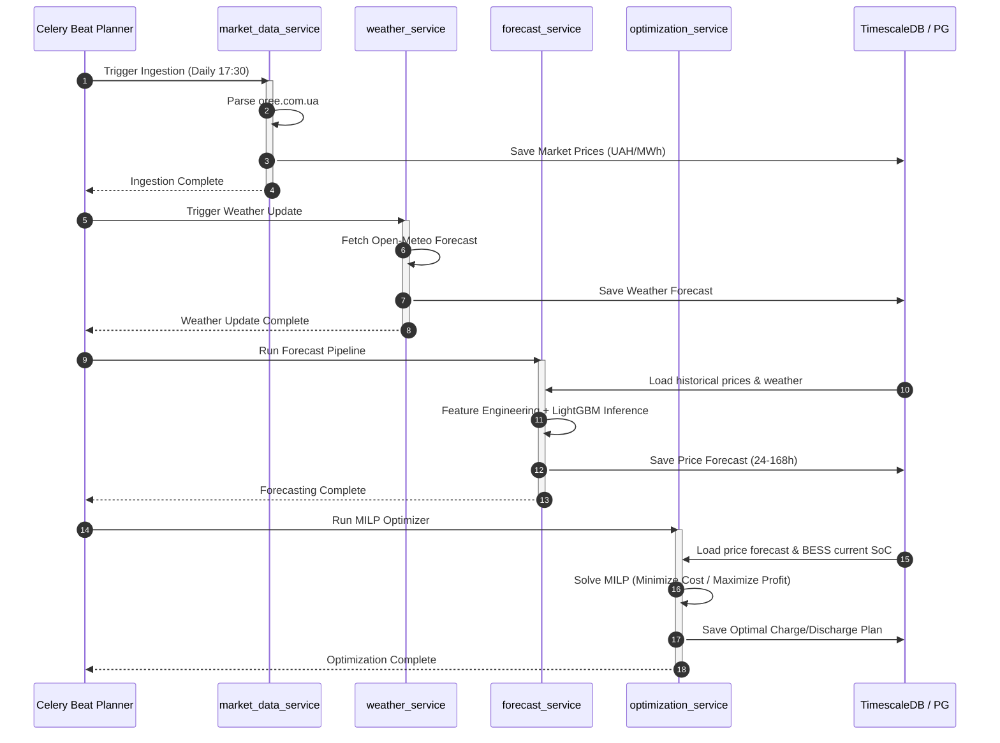
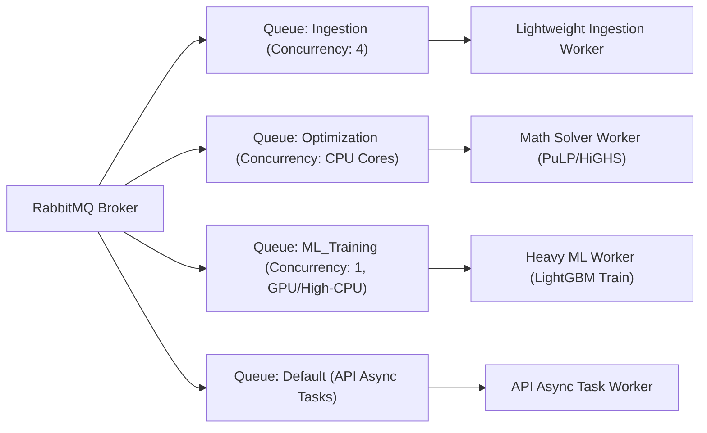

# Архитектурный проект (Technical Design Document) бэкенда SmartBESS Analytics Platform
## Автор: Senior Backend Architect

---

## 1. Выбор архитектурного шаблона: Модульный монолит (Modular Monolith)

Для промышленного enterprise-внедрения платформы SmartBESS на текущем этапе рекомендуется шаблон **Модульного монолита** с асинхронным выполнением тяжелых задач через распределенную очередь (Celery).

```mermaid
graph TD
    subgraph Client Layer
        Web["React Web App / Dashboard"]
        SCADA["BESS Controller (Modbus Client)"]
    end

    subgraph API Gateway / Reverse Proxy
        Nginx["Nginx (SSL & Load Balancer)"]
    end

    subgraph Modular Monolith (FastAPI App)
        API["FastAPI HTTP / WS App"]
        subgraph Domain Modules
            MDS["market_data_service"]
            WS["weather_service"]
            FS["forecast_service"]
            OS["optimization_service"]
            TS["tariff_service"]
            SS["scenario_service"]
            RS["reporting_service"]
            AS["auth_service"]
        end
    end

    subgraph Message Broker
        RMQ["RabbitMQ (Celery Broker)"]
    end

    subgraph Background Workers (Celery)
        Worker_Heavy["Celery Heavy Workers (ML Training, MILP Optimization)"]
        Worker_Light["Celery Light Workers (Ingestion, Sync, SCADA polling)"]
    end

    subgraph Database Layer
        Timescale[("PostgreSQL + TimescaleDB (Core DB)")]
        Redis[("Redis (State & Celery Backend & Cache)")]
    end

    Web --> Nginx
    SCADA --> Nginx
    Nginx --> API

    API --> MDS & WS & FS & OS & TS & SS & RS & AS
    MDS & WS & FS & OS & TS & SS & RS & AS --> RMQ
    RMQ --> Worker_Heavy & Worker_Light

    Worker_Heavy & Worker_Light --> Timescale
    Worker_Heavy & Worker_Light --> Redis
    API --> Timescale
    API --> Redis
```

### Аргументация выбора:

1. **Производительность и задержки (Low Latency)**: ML-прогнозирование и математическая оптимизация оперируют большими массивами данных (матрицами временных рядов). В микросервисной архитектуре передача сотен тысяч строк между сервисом данных, сервисом ML и сервисом оптимизации по HTTP/gRPC создает высокие накладные расходы на сериализацию/десериализацию. Модульный монолит позволяет передавать ссылки на объекты в памяти (In-Memory).
2. **Изоляция доменов при простоте деплоя**: Код разделен на строгие пакеты (папки) без перекрестных циклических импортов. Взаимодействие между модулями происходит через четко определенные внутренние интерфейсы (Service Interfaces). Это позволяет при росте нагрузок выделить любой модуль (например, `forecast_service` на GPU-инстансы) в отдельный микросервис без переписывания остальной системы.
3. **Отказоустойчивость и масштабирование**: Тяжелые расчеты (обучение LightGBM, решение MILP с помощью HiGHS/CBC) полностью делегированы **Celery-воркерам**, которые разворачиваются на отдельных вычислительных узлах. Основной веб-сервер FastAPI остается легковесным, асинхронным и обслуживает API-запросы за миллисекунды, гарантируя высокий показатель Uptime.

---

## 2. Структура папок проекта

Проект организован по принципам Domain-Driven Design (DDD) со строгим разделением доменов:

```text
smartbess-backend/
├── config/                     # Системные конфигурации (gunicorn, celery, postgres)
├── data/                       # Локальные кэши и файлы моделей (для DEV-окружения)
├── migrations/                 # Миграции базы данных (Alembic)
├── src/
│   ├── __init__.py
│   ├── main.py                 # Точка входа FastAPI
│   ├── celery_app.py           # Конфигурация распределенной очереди Celery
│   │
│   ├── api/                    # Слой REST API (Маршрутизаторы и схемы)
│   │   ├── v1/
│   │   │   ├── endpoints/      # Эндпоинты, сгруппированные по доменам
│   │   │   │   ├── market.py
│   │   │   │   ├── forecast.py
│   │   │   │   ├── optimization.py
│   │   │   │   └── reports.py
│   │   │   └── api.py          # Корневой роутер v1
│   │   └── deps.py             # FastAPI Dependencies (get_db, current_user, etc.)
│   │
│   ├── core/                   # Общесистемные модули
│   │   ├── config.py           # Загрузка переменных окружения (Pydantic Settings)
│   │   ├── database.py         # Подключение к PostgreSQL (SQLAlchemy Session)
│   │   ├── security.py         # Хеширование паролей, JWT-токены
│   │   └── exceptions.py       # Кастомные ошибки бэкенда
│   │
│   ├── modules/                # Изолированные доменные модули (Modular Monolith)
│   │   ├── auth_service/
│   │   │   ├── models.py       # Таблицы пользователей и ролей
│   │   │   ├── schemas.py      # Pydantic схемы валидации
│   │   │   ├── services.py     # Логика Keycloak / OAuth2 / JWT
│   │   │   └── router.py       # Внутренний роутер модуля
│   │   │
│   │   ├── market_data_service/
│   │   │   ├── models.py       # Таблица цен РДН (market_prices)
│   │   │   ├── parser.py       # Парсер oree.com.ua / ENTSO-E
│   │   │   └── tasks.py        # Celery задачи сбора цен
│   │   │
│   │   ├── weather_service/
│   │   │   ├── client.py       # Клиент OpenWeather / Open-Meteo
│   │   │   ├── models.py       # Таблица архивов и прогнозов погоды
│   │   │   └── tasks.py        # Celery задачи обновления погоды
│   │   │
│   │   ├── forecast_service/
│   │   │   ├── ml_pipeline.py  # Обучение и инференс LightGBM/XGBoost
│   │   │   ├── models.py       # Таблица прогнозов цен (price_forecasts)
│   │   │   └── tasks.py        # Celery задачи обучения моделей
│   │   │
│   │   ├── optimization_service/
│   │   │   ├── milp_model.py   # Математическая модель MILP (PuLP/Pyomo)
│   │   │   ├── models.py       # Таблица планов BESS (charge_discharge_plans)
│   │   │   └── tasks.py        # Асинхронные расчеты расписания
│   │   │
│   │   ├── tariff_service/
│   │   │   ├── models.py       # Тарифные сетки Облэнерго Украины
│   │   │   └── services.py     # Расчет стоимости с учетом классов напряжения
│   │   │
│   │   ├── scenario_service/
│   │   │   ├── models.py       # Шаблоны сценариев (военные риски, цены на газ)
│   │   │   └── simulator.py    # Математические корректировки цен
│   │   │
│   │   └── reporting_service/
│   │       ├── profit_loss.py  # Расчет P&L, ROI, окупаемости
│   │       ├── var_engine.py   # Расчет Value-at-Risk (VaR) методом Монте-Карло
│   │       └── exporter.py     # Генерация PDF/Excel отчетов
│   │
│   └── tasks/                  # Воркеры Celery и планировщик Tasks
│       ├── scheduler.py        # Настройки Celery Beat / APScheduler
│       └── base_task.py        # Базовый класс задач (логирование, retry)
│
├── tests/                      # Модульные и интеграционные тесты
│   ├── conftest.py
│   ├── test_api/
│   ├── test_ml/
│   └── test_optimizer/
│
├── .env.example
├── Dockerfile
├── docker-compose.yml
└── requirements.txt
```

---

## 3. Описание доменных модулей

### 3.1. `market_data_service`
Отвечает за сбор, очистку и хранение ценовых и инфраструктурных показателей энергорынка Украины.
*   **Источники данных**: API/Парсинг сайта Оператора Рынка (`oree.com.ua`), ENTSO-E Transparency Platform (импорт/экспорт электроэнергии), данные НЭК «Укрэнерго» по генерации.
*   **Функции**: Выкачивание почасовых цен РДН, ВГР и балансирующего рынка. Фильтрация выбросов, интерполяция пропусков данных.
*   **Механизм резервирования**: При недоступности основного API «Оператора Рынка» переключается на XML-фид или FTP-сервер Укрэнерго.

### 3.2. `weather_service`
Управляет метеорологическими данными, критически важными для прогнозирования выработки ВИЭ и потребления сети.
*   **Источники данных**: OpenWeatherMap API, Open-Meteo, ECMWF.
*   **Параметры**: Температура воздуха, облачность (%), скорость и направление ветра, солнечная инсоляция ($W/m^2$).
*   **Логика работы**: Хранит архив погоды за 5 лет (для обучения ML) и текущий прогноз на 168 часов вперед для инференса.

### 3.3. `forecast_service`
Контур машинного обучения для предсказания почасовых цен.
*   **Модели**: LightGBM, XGBoost, MLP.
*   **Функции**: Формирование датасета (лаги, скользящие средние, календарные индексы), регулярное переобучение моделей (по умолчанию — раз в неделю), генерация почасового прогноза цен РДН на горизонт до 168 часов с расчетом доверительных интервалов (квантили 10% и 90%).

### 3.4. `optimization_service`
Ядро принятия решений по управлению BESS.
*   **Математический аппарат**: MILP-модель.
*   **Входные параметры**: Прогноз цен РДН, текущий SoC из телеметрии, технические параметры BESS (емкость, мощность, КПД, стоимость деградации), тарифный профиль объекта.
*   **Выходные данные**: Почасовой график заряда/разряда.
*   **Принцип управления**: Реализация MPC (Model Predictive Control) с перезапуском оптимизации каждые 15 минут для компенсации отклонений.

### 3.5. `tariff_service`
Справочник и калькулятор стоимости доставки электроэнергии.
*   **Данные**: Ставки тарифа на передачу НЭК «Укрэнерго», тарифы на распределение всех Облэнерго Украины (1 и 2 классы напряжения), тариф на диспетчеризацию, налоги и маржа энергопоставщика.
*   **Функции**: Расчет полной стоимости покупки 1 кВт·ч для промышленных потребителей "Behind-the-Meter" в конкретном регионе.

### 3.6. `scenario_service`
Инструмент риск-менеджмента и сценарного моделирования.
*   **Параметры сценариев**: Обстрелы сетевой инфраструктуры, вывод блоков АЭС в ремонт, критические скачки цен на газ в ЕС, повреждения СЭС (снижение генерации).
*   **Функции**: Наложение детерминированных и стохастических возмущений на базовый прогноз цен РДН для проверки устойчивости бизнес-модели BESS.

### 3.7. `reporting_service`
Аналитический модуль для финансового мониторинга и оценки эффективности инвестиций.
*   **Финансовые метрики**: P&L (прибыли и убытки) за период, ROI (окупаемость инвестиций), Payback Period (срок окупаемости BESS с учетом дисконтирования).
*   **Анализ рисков**: Расчет VaR (Value at Risk) методом Монте-Карло для оценки максимальных возможных убытков от арбитража в неблагоприятных рыночных сценариях.

### 3.8. `auth_service`
Модуль информационной безопасности и разграничения прав доступа.
*   **Технологии**: JWT (JSON Web Tokens), интеграция с протоколом OAuth2 / OpenID Connect через внешнего провайдера (Keycloak) или внутренний легковесный OAuth2-модуль на FastAPI.
*   **Роли**: Администратор (Manager), Диспетчер (Operator), Аналитик (Viewer).

---

## 4. Схема взаимодействия сервисов (Service Interaction Flow)

Ниже представлена последовательность выполнения ежедневного расчета оптимального расписания BESS и записи результатов в базу данных:



---

## 5. Очереди задач и планировщик (Celery / Queue Strategy)

Для предотвращения блокировки критических задач медленными вычислениями (например, обучение нейросетей не должно мешать быстрому сбору данных) в системе настраивается **4 независимые Celery-очереди**:



### Конфигурация Celery Queues:

1.  **`ingestion`** (Очередь сбора данных):
    *   *Задачи*: Ежечасный сбор погоды, ежедневный парсинг РДН в 17:30, опрос Modbus SCADA телеметрии.
    *   *Параметры*: Низкий приоритет процессора, высокая конкурентность (Concurrency = 4), таймауты до 5 минут.
2.  **`optimization`** (Очередь расчетов BESS):
    *   *Задачи*: Запуск MILP оптимизации, пересчет MPC каждые 15 минут.
    *   *Параметры*: Высокий приоритет CPU, Concurrency = число физических ядер CPU, использование быстрых солверов (HiGHS).
3.  **`ml_training`** (Очередь обучения моделей):
    *   *Задачи*: Еженедельное переобучение LightGBM/XGBoost/MLP.
    *   *Параметры*: Concurrency = 1 (для исключения Out-Of-Memory ошибок), запуск в ночное время, низкий приоритет планирования.
4.  **`default`** (Общие задачи):
    *   *Задачи*: Отправка E-mail уведомлений, генерация Excel отчетов, экспорт данных по запросу пользователя.

---

## 6. Структура PostgreSQL (TimescaleDB) и Redis

Платформа использует гибридное хранилище: PostgreSQL для долгосрочного хранения транзакций и временных рядов, Redis — для оперативного кэша и очередей.

### Схема таблиц базы данных (TimescaleDB)

```sql
-- Включение необходимых расширений
CREATE EXTENSION IF NOT EXISTS "uuid-ossp";
CREATE EXTENSION IF NOT EXISTS timescaledb CASCADE;

-- 1. Таблица организаций (Справочник)
CREATE TABLE organizations (
    id UUID PRIMARY KEY DEFAULT uuid_generate_v4(),
    name VARCHAR(255) NOT NULL UNIQUE,
    country VARCHAR(50) DEFAULT 'UA',
    created_at TIMESTAMP WITH TIME ZONE DEFAULT CURRENT_TIMESTAMP
);

-- 2. Таблица пользователей
CREATE TABLE users (
    id UUID PRIMARY KEY DEFAULT uuid_generate_v4(),
    organization_id UUID REFERENCES organizations(id) ON DELETE CASCADE,
    email VARCHAR(255) NOT NULL UNIQUE,
    password_hash VARCHAR(255) NOT NULL,
    role VARCHAR(50) NOT NULL CHECK (role IN ('Manager', 'Operator', 'Viewer')),
    is_active BOOLEAN DEFAULT TRUE,
    created_at TIMESTAMP WITH TIME ZONE DEFAULT CURRENT_TIMESTAMP
);

-- 3. Таблица физических активов BESS
CREATE TABLE assets (
    id UUID PRIMARY KEY DEFAULT uuid_generate_v4(),
    organization_id UUID REFERENCES organizations(id) ON DELETE CASCADE,
    name VARCHAR(255) NOT NULL,
    capacity_kwh NUMERIC(12, 2) NOT NULL,
    max_charge_power_kw NUMERIC(10, 2) NOT NULL,
    max_discharge_power_kw NUMERIC(10, 2) NOT NULL,
    charge_efficiency NUMERIC(4, 3) DEFAULT 0.95,
    discharge_efficiency NUMERIC(4, 3) DEFAULT 0.95,
    min_soc_pct NUMERIC(5, 2) DEFAULT 10.0,
    max_soc_pct NUMERIC(5, 2) DEFAULT 90.0,
    degradation_cost_kwh NUMERIC(8, 2) NOT NULL, -- Стоимость деградации ячеек в грн на 1 кВт-ч
    created_at TIMESTAMP WITH TIME ZONE DEFAULT CURRENT_TIMESTAMP
);

-- 4. Исторические цены РДН (Временной ряд - Hypertable)
CREATE TABLE market_prices (
    timestamp TIMESTAMP WITH TIME ZONE NOT NULL,
    price_uah NUMERIC(10, 2) NOT NULL,
    price_eur NUMERIC(10, 2) NOT NULL,
    volume_mwh NUMERIC(12, 3),
    area VARCHAR(10) NOT NULL DEFAULT 'UA_IPS'
);
SELECT create_hypertable('market_prices', 'timestamp');
CREATE UNIQUE INDEX idx_market_prices_unique ON market_prices (timestamp, area);

-- 5. Прогнозы цен (Временной ряд - Hypertable)
CREATE TABLE price_forecasts (
    timestamp TIMESTAMP WITH TIME ZONE NOT NULL,
    forecast_run_at TIMESTAMP WITH TIME ZONE NOT NULL,
    model_version VARCHAR(50) NOT NULL,
    predicted_price_uah NUMERIC(10, 2) NOT NULL,
    lower_bound_uah NUMERIC(10, 2),
    upper_bound_uah NUMERIC(10, 2)
);
SELECT create_hypertable('price_forecasts', 'timestamp');
CREATE INDEX idx_price_forecasts_lookup ON price_forecasts (forecast_run_at DESC, timestamp);

-- 6. Телеметрия BESS (Временной ряд - Hypertable)
CREATE TABLE bess_telemetry (
    timestamp TIMESTAMP WITH TIME ZONE NOT NULL,
    asset_id UUID NOT NULL,
    soc_pct NUMERIC(5, 2) NOT NULL,
    active_power_kw NUMERIC(10, 2) NOT NULL, -- Отрицательное = заряд, Положительное = разряд
    temperature_c NUMERIC(5, 2),
    soh_pct NUMERIC(5, 2),
    system_status VARCHAR(50)
);
SELECT create_hypertable('bess_telemetry', 'timestamp');
CREATE INDEX idx_bess_telemetry_asset ON bess_telemetry (asset_id, timestamp DESC);

-- 7. Планы оптимизации BESS (Временной ряд - Hypertable)
CREATE TABLE charge_discharge_plans (
    timestamp TIMESTAMP WITH TIME ZONE NOT NULL,
    asset_id UUID NOT NULL,
    optimized_run_at TIMESTAMP WITH TIME ZONE NOT NULL,
    target_power_kw NUMERIC(10, 2) NOT NULL,
    expected_soc_kwh NUMERIC(12, 2) NOT NULL,
    expected_profit_uah NUMERIC(12, 2) NOT NULL
);
SELECT create_hypertable('charge_discharge_plans', 'timestamp');
CREATE INDEX idx_plans_lookup ON charge_discharge_plans (asset_id, optimized_run_at DESC, timestamp);
```

### Структура хранения в Redis

1.  **Кэш котировок и погоды**:
    *   *Ключ*: `weather:forecast:{lat}:{lon}` — сериализованный JSON-прогноз погоды на 24 часа. TTL = 30 минут.
    *   *Ключ*: `market:current_price` — текущая спотовая цена РДН. TTL = 1 час.
2.  **Состояние работы BESS (State Lock)**:
    *   *Ключ*: `bess:state:{asset_id}` — текущий статус контроллера (SoC, режим ручной/авто). Используется для отображения на WebSocket-клиентах.
3.  **Очереди задач (Celery Broker)**:
    *   Базы данных `db=0` под Celery задачи, `db=1` под кэш приложения.

---

## 7. Требования к отказоустойчивости (Fault Tolerance & Resiliency)

Для обеспечения Uptime 99.9% в условиях войны и нестабильности связи в бэкенд закладываются следующие механизмы:

1.  **Политика повторных попыток (Retry Policy) для Ingestion**:
    *   При сбое сети парсер `market_data_service` делает до **5 попыток** повторного запроса с экспоненциальной задержкой (Exponential Backoff): $T_{wait} = 2^{attempt} \times 5$ секунд.
2.  **Резервирование источников данных (Data Source Fallback)**:
    *   *Погода*: Если API OpenWeatherMap возвращает 5xx или таймаут, сервис автоматически переключается на резервный Open-Meteo API.
    *   *Цены*: Если API «Оператора Рынка» недоступен, Celery-задача парсит цены через резервный XML-фид Укрэнерго или обращается к исторической средней за аналогичный день недели.
3.  **Автономный режим оптимизатора (Offline Solver Fallback)**:
    *   Если по какой-то причине ML-прогноз цен не сгенерировался до 18:00, оптимизатор автоматически загружает из БД **профиль цен РДН за аналогичный день прошлой недели** в качестве прогноза-заменителя и строит расписание по нему, предотвращая простой BESS.
4.  **Circuit Breaker (Предохранитель)**:
    *   Интеграции с внешними SCADA BESS защищены паттерном Circuit Breaker. Если Modbus-контроллер BESS не отвечает на 3 запроса подряд, контур "EMS-SCADA" временно размыкается, генерируя Alarm-уведомление в Slack/Telegram диспетчера, предотвращая накопление зависших TCP-соединений.

---

## 8. Спецификация API (OpenAPI / Swagger)

Ниже приведен пример структуры Swagger/OpenAPI спецификации для ключевых эндпоинтов платформы SmartBESS:

```yaml
openapi: 3.0.3
info:
  title: SmartBESS Core API
  version: 1.0.0
  description: API для прогнозирования цен РДН и оптимизации систем накопления энергии BESS в Украине.
paths:
  /api/v1/forecast:
    post:
      summary: Получить прогноз цен РДН
      description: Генерирует прогноз цен на указанную дату с учетом сценарных факторов.
      parameters:
        - name: Authorization
          in: header
          required: true
          schema:
            type: string
            example: Bearer eyJhbGciOiJIUzI1NiIsInR5cCI6IkpXVCJ9...
      requestBody:
        required: true
        content:
          application/json:
            schema:
              type: object
              required:
                - date
              properties:
                date:
                  type: string
                  format: date
                  example: "2026-07-09"
                selected_model:
                  type: string
                  enum: [lightgbm, xgboost, mlp]
                  default: lightgbm
                gas_price:
                  type: number
                  description: Цена на газ на хабе TTF (EUR/MWh)
                  example: 35.0
                nuclear_outage:
                  type: number
                  description: Доля выведенных из эксплуатации АЭС (0.0 - 1.0)
                  example: 0.15
      responses:
        '200':
          description: Прогноз цен успешно построен
          content:
            application/json:
              schema:
                type: object
                properties:
                  date:
                    type: string
                  hours:
                    type: array
                    items:
                      type: integer
                  predicted_prices:
                    type: array
                    items:
                      type: number
                    example: [3200.50, 2900.00, 10.00, 7800.20]
        '401':
          description: Не авторизован
        '500':
          description: Внутренняя ошибка сервера прогнозирования

  /api/v1/optimization/schedule:
    post:
      summary: Расчет оптимального графика BESS
      description: Запуск MILP-солвера для генерации почасового расписания заряда/разряда.
      requestBody:
        required: true
        content:
          application/json:
            schema:
              type: object
              required:
                - asset_id
                - date
              properties:
                asset_id:
                  type: string
                  format: uuid
                  example: "a1b2c3d4-e5f6-7a8b-9c0d-1e2f3a4b5c6d"
                date:
                  type: string
                  format: date
                  example: "2026-07-09"
                initial_soc_pct:
                  type: number
                  default: 20.0
                mode:
                  type: string
                  enum: [arbitrage, self_consumption]
                  default: arbitrage
      responses:
        '200':
          description: Оптимальное расписание рассчитано
          content:
            application/json:
              schema:
                type: object
                properties:
                  status:
                    type: string
                    example: "Optimal"
                  net_profit_uah:
                    type: number
                    example: 38450.50
                  cycles_used:
                    type: number
                    example: 1.12
                  schedule:
                    type: array
                    items:
                      type: object
                      properties:
                        hour:
                          type: integer
                        action:
                          type: string
                          enum: [CHARGE, DISCHARGE, STANDBY]
                        power_kw:
                          type: number
                        target_soc_kwh:
                          type: number
        '422':
          description: Ошибка валидации параметров BESS
```
