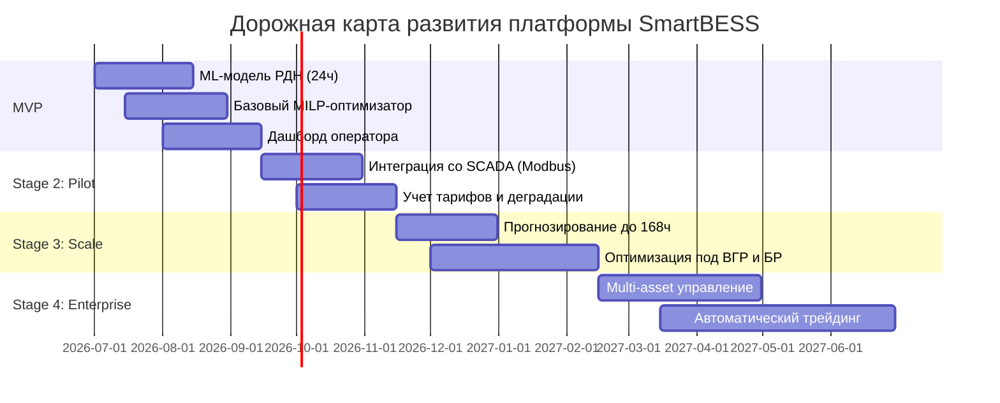

# Технический проект (Blueprint) платформы SmartBESS Ukraine
## Промышленная платформа прогнозирования цен РДН и оптимизации BESS для рынка электроэнергии Украины

---

## 1. Введение и бизнес-контекст
Украинский рынок электроэнергии функционирует в условиях беспрецедентной волатильности, вызванной военными повреждениями традиционной генерации, сетевыми ограничениями и динамичным ростом доли возобновляемых источников энергии (ВИЭ). Колебания цен на Рынке на сутки вперед (РДН / DAM) создают как высокие финансовые риски для потребителей, так и уникальные возможности для арбитража с использованием систем накопления энергии (BESS).

Данная платформа разработана для трех ключевых сегментов:
1. **Промышленные потребители (Prosumers)** — минимизация стоимости покупки электроэнергии с учетом тарифов на передачу, распределение, диспетчеризацию и маржи поставщика.
2. **Трейдеры** — максимизация прибыли от ценового арбитража на сегментах РДН, ВГР (внутрисуточный рынок) и балансирующем рынке (БР).
3. **Владельцы BESS (как самостоятельных активов)** — оптимизация циклов заряда/разряда для максимизации IRR с учетом физической деградации батарей.

---

## 2. Архитектура системы по слоям

Система построена на принципах микросервисной событийно-ориентированной архитектуры (Event-Driven Architecture) с разделением контуров хранения данных, аналитики (ML), математической оптимизации и клиентского обслуживания.

```mermaid
graph TD
    subgraph Data Sources
        DS_EN["НЭК Укрэнерго (API/FTP)"]
        DS_ENTSOE["ENTSO-E Transparency Platform"]
        DS_WX["Weather APIs (Open-Meteo, ECMWF)"]
        DS_BESS["BESS Telemetry (Modbus/MQTT/SCADA)"]
    end

    subgraph Ingestion & Queue
        Ingest["Ingestion Service (FastAPI CLI / Python)"]
        Queue["RabbitMQ / Celery"]
    end

    subgraph Storage
        DB[("PostgreSQL (TimescaleDB Ext.)")]
        Cache[("Redis (State & Cache)")]
    end

    subgraph Analytics & Math
        ML["ML forecasting Engine (XGBoost, LightGBM, N-BEATS)"]
        Opt["Optimization Engine (MILP - Pyomo / HiGHS)"]
    end

    subgraph Backend API
        API["FastAPI App (Core REST & WebSocket)"]
        Auth["Keycloak / OAuth2"]
    end

    subgraph Frontend & Clients
        Web["React Dashboard (Vite, Tailwind, Tremor)"]
        SCADA["BESS Controller (Modbus TCP Client)"]
    end

    DS_EN --> Ingest
    DS_ENTSOE --> Ingest
    DS_WX --> Ingest
    DS_BESS --> Ingest

    Ingest --> Queue
    Queue --> DB
    Queue --> Cache

    DB --> ML
    DB --> Opt
    Cache --> Opt

    ML --> DB
    Opt --> DB
    Opt --> Cache

    DB --> API
    Cache --> API
    Auth --> API
    API --> Web
    API --> SCADA
```



### Описание слоев:
1. **Data Sources (Источники данных)**: Внешние интеграции с НЭК "Укрэнерго" (ГП "Оператор рынка"), ENTSO-E (для отслеживания перетоков с ЕС), метеорологическими провайдерами и SCADA/EMS-системой конкретной BESS.
2. **Ingestion Layer (Сбор данных)**: Асинхронные воркеры на Celery, запускаемые по расписанию для парсинга и валидации данных. Применяются политики Retry и DLQ (Dead Letter Queue) для обеспечения отказоустойчивости.
3. **Storage Layer (Хранение)**:
   - **PostgreSQL** с расширением **TimescaleDB** для временных рядов (цены, телеметрия BESS, прогнозы).
   - **Redis** для кэширования API-запросов, хранения промежуточных состояний (State) оптимизатора и сессий пользователей.
4. **ML & Forecasting Layer**: Контур периодического переобучения и инференса моделей прогноза цен РДН. Результаты прогнозирования записываются в БД с версионированием.
5. **Optimization Layer (MILP)**: Математический модуль, генерирующий оптимальный график работы BESS на основе прогноза цен, текущего State-of-Charge (SoC), параметров износа батареи и сетевых тарифов.
6. **Backend API Layer**: REST API на FastAPI, предоставляющий интерфейс для фронтенда и промышленных контроллеров BESS.
7. **Frontend Layer**: Панель управления на React (SPA) с интерактивными графиками энергопотоков, финансовой аналитики и управления режимами работы.
8. **Auth & Security**: Аутентификация на базе протокола OpenID Connect (OIDC) с использованием Keycloak.
9. **Deployment & Observability**: Контейнеризация Docker, оркестрация Docker Compose / Kubernetes, мониторинг с использованием Prometheus, Grafana и логированием через Vector/Elasticsearch.

---

## 3. Технологический стек

| Компонент | Выбранная технология | Обоснование выбора |
| :--- | :--- | :--- |
| **Backend Framework** | Python 3.11 + FastAPI | Высокая производительность (ASGI), встроенная валидация данных (Pydantic), автогенерация OpenAPI. |
| **Database** | PostgreSQL + TimescaleDB | Реляционная СУБД для метаданных с мощным расширением для эффективного хранения и агрегации временных рядов. |
| **In-memory DB / Cache**| Redis | Хранение сессий, кэширование котировок, координация блокировок задач. |
| **Task Queue** | Celery + RabbitMQ | Надежная обработка фоновых задач, очередей парсинга и тяжелых вычислений оптимизации. |
| **Forecasting Stack** | Scikit-learn, XGBoost, LightGBM, PyTorch | Проверенные библиотеки для табличных временных рядов и глубоких сетей прогнозирования. |
| **Optimization Stack** | Pyomo + HiGHS Solver | Pyomo позволяет гибко описывать математическую модель (MILP). HiGHS — быстрый open-source солвер. |
| **Frontend Stack** | React (TypeScript) + Vite + Tailwind CSS | Высокая скорость разработки UI, оптимизация сборки, готовые компоненты для графиков (например, Tremor/Recharts). |
| **Reverse Proxy / Web** | Nginx | Обратное проксирование, SSL-терминация (Let's Encrypt), отдача статики. |
| **Infrastructure** | Docker + Docker Compose + Ansible | Простота локального развертывания и масштабирования на выделенных серверах (Bare Metal/AWS). |
| **Observability** | Prometheus, Grafana, Loguru + Vector | Сбор системных и бизнес-метрик (точность моделей, экономический эффект), централизованное логирование. |

---

## 4. Компонент прогнозирования цен РДН (ML & Forecasting)

Рынок на сутки вперед (РДН) в Украине характеризуется предельными ценами (price caps), которые устанавливает регулятор (НКРЭКУ), возможностью отрицательных цен при избытке генерации ВИЭ, а также резкими скачками цен (price spikes) в часы пиковых нагрузок из-за дефицита мощности.

### Feature Engineering (Конструирование признаков)
Для обучения моделей формируется расширенное признаковое пространство:
1. **Временные признаки (Calendar features)**:
   - Час суток (0–23), день недели (0–6), месяц, день года.
   - Циклические преобразования через синус/косинус: $sin(2\pi \cdot hour / 24)$, $cos(2\pi \cdot hour / 24)$.
   - Признак выходного/праздничного дня (с учетом графиков переносов в Украине).
2. **Лаговые признаки (Lag features)**:
   - Цены РДН за аналогичный час предыдущего дня ($Y_{t-24}$), за 48, 72 и 168 часов назад.
   - Скользящие средние, стандартные отклонения и мин/макс значения цен за последние 6, 12, 24 и 168 часов.
3. **Внешние фундаментальные факторы**:
   - **Погода**: температура воздуха, облачность, скорость ветра в ключевых промышленных узлах (Киев, Днепр, Харьков, Львов) для прогноза потребления и выработки СЭС/ВЭС.
   - **Генерация и спрос**: Прогноз потребления энергосистемы (публикуется Укрэнерго), доступная мощность атомных блоков (плановые ремонты), уровень гидрогенерации.
   - **Импорт/Экспорт**: Забронированные сечения межгосударственных линий электропередачи со странами ЕС (Польша, Венгрия, Словакия, Румыния).
   - **Топливный фактор**: Цены на природный газ на европейском хабе TTF и украинской энергетической бирже (УЭБ).
   - **Аварийные факторы**: Индексы стабильности сети (частота отключений, дефицит мощности в системе).

### Архитектура моделей и ансамблирование
Для покрытия горизонта от 24 до 168 часов применяется двухэтапный стек моделей:

1. **Базовый уровень (Level 0)**:
   - **LightGBM / XGBoost**: Отлично работают с табличными данными и нелинейными зависимостями, учитывают price caps как жесткие границы.
   - **Prophet / NeuralProphet**: Улавливают долгосрочные тренды и годовую сезонность.
   - **N-BEATS / Temporal Fusion Transformer (TFT)**: Глубокие нейросети для многошагового прогнозирования временных рядов, хорошо моделируют сложные временные зависимости.
2. **Мета-модель (Level 1 - Stacking)**:
   - Линейная регрессия с L1/L2 регуляризацией (Ridge/Lasso) или Ridge с ограничениями на неотрицательность весов для объединения прогнозов базовых моделей. Это минимизирует дисперсию ошибки прогнозирования.

### Метрики качества
Для оценки точности прогнозирования используются:
- **MAPE** (Mean Absolute Percentage Error) — основная бизнес-метрика. Целевой показатель для стабильных дней: $<8\%$, для дней с резкими изменениями генерации: $<12\%$.
- **MAE** (Mean Absolute Error) — для оценки абсолютной погрешности в грн/МВт·ч.
- **WAPE** (Weighted Absolute Percentage Error) — нивелирует проблему деления на околонулевые значения (актуально при появлении цен близких к нулю).

---

## 5. Компонент оптимизации BESS (Optimizer)

Математическая модель формулируется как задача смешанно-целочисленного линейного программирования (**MILP** - Mixed-Integer Linear Programming) для предотвращения одновременного заряда и разряда BESS и корректного учета нелинейной деградации.

### Переменные модели
Для каждого часа $t \in \{1, \dots, T\}$ горизонта планирования (обычно $T=24$ или $T=168$):
- $p^{ch}_t \ge 0$ — мощность заряда BESS в час $t$ (МВт).
- $p^{dis}_t \ge 0$ — мощность разряда BESS в час $t$ (МВт).
- $x^{ch}_t \in \{0, 1\}$ — бинарная переменная: 1, если батарея заряжается.
- $x^{dis}_t \in \{0, 1\}$ — бинарная переменная: 1, если батарея разряжается.
- $soc_t$ — уровень заряда батареи на конец часа $t$ (МВт·ч).
- $c^{deg}_t$ — стоимость деградации батареи при работе в час $t$ (грн).

### Параметры системы
- $CAP$ — номинальная энергоемкость BESS (МВт·ч).
- $P^{max}$ — максимальная мощность заряда/разряда (МВт).
- $\eta^{ch}, \eta^{dis}$ — КПД процессов заряда и разряда соответственно (доли единицы, обычно $0.90 - 0.95$).
- $SoC^{min}, SoC^{max}$ — минимально и максимально допустимый уровень заряда (обычно $10\%$ и $90\%$ для продления ресурса).
- $C^{cap}_t$ — прогнозируемая цена электроэнергии на РДН в час $t$ (грн/МВт·ч).
- $Tariff^{trans}$ — тариф на передачу электроэнергии (грн/МВт·ч).
- $Tariff^{disp}$ — тариф на диспетчерское управление (грн/МВт·ч).
- $Margin^{supp}$ — маржа поставщика (грн/МВт·ч).
- $Cost^{deg\_base}$ — базовая стоимость износа LCOS (Levelized Cost of Storage) за один номинальный цикл (грн/МВт·ч).

### Целевая функция (Objective Function)
Для промышленного потребителя (цель — минимизация затрат на электроснабжение с помощью BESS):

$$\min \sum_{t=1}^{T} \left[ \left( C^{cap}_t + Tariff^{trans} + Tariff^{disp} + Margin^{supp} \right) \cdot p^{ch}_t - C^{cap}_t \cdot p^{dis}_t + c^{deg}_t \right]$$

Для инвестора/трейдера BESS (цель — максимизация прибыли от арбитража):

$$\max \sum_{t=1}^{T} \left[ \left( C^{cap}_t - Tariff^{trans\_output} \right) \cdot p^{dis}_t - \left( C^{cap}_t + Tariff^{trans} + Tariff^{disp} \right) \cdot p^{ch}_t - c^{deg}_t \right]$$

### Ограничения (Constraints)

1. **Баланс уровня заряда (State of Charge State Equation)**:
   $$soc_t = soc_{t-1} + \left( p^{ch}_t \cdot \eta^{ch} - \frac{p^{dis}_t}{\eta^{dis}} \right) \cdot \Delta t$$
   Где $\Delta t = 1$ час.

2. **Границы уровня заряда**:
   $$SoC^{min} \le soc_t \le SoC^{max}$$

3. **Ограничения на мощность заряда и разряда**:
   $$p^{ch}_t \le P^{max} \cdot x^{ch}_t$$
   $$p^{dis}_t \le P^{max} \cdot x^{dis}_t$$

4. **Исключение одновременного заряда и разряда**:
   $$x^{ch}_t + x^{dis}_t \le 1$$
   $$x^{ch}_t, x^{dis}_t \in \{0, 1\}$$

5. **Граничные условия для SoC**:
   $$soc_0 = SoC^{initial}$$
   $$soc_T \ge SoC^{target} \quad \text{(требуемый уровень заряда в конце расчетного периода)}$$

6. **Учет стоимости деградации (LCOS Degradation Constraint)**:
   $$c^{deg}_t = Cost^{deg\_base} \cdot \left( \frac{p^{ch}_t \cdot \eta^{ch} + p^{dis}_t / \eta^{dis}}{2} \right) \cdot f(Temp_t, soc_t)$$
   Где $f(Temp_t, soc_t)$ — нелинейный поправочный коэффициент износа от температуры и глубины разряда (DOD), аппроксимированный кусочно-линейными функциями для сохранения структуры MILP.

---

## 6. Структура Базы Данных (PostgreSQL / TimescaleDB)

```sql
-- Включение расширения TimescaleDB для работы с временными рядами
CREATE EXTENSION IF NOT EXISTS timescaledb;

-- 1. Таблица организаций-клиентов
CREATE TABLE organizations (
    id UUID PRIMARY KEY DEFAULT gen_random_uuid(),
    name VARCHAR(255) NOT NULL,
    country VARCHAR(50) DEFAULT 'UA',
    created_at TIMESTAMP WITH TIME ZONE DEFAULT CURRENT_TIMESTAMP
);

-- 2. Таблица активов (BESS)
CREATE TABLE assets (
    id UUID PRIMARY KEY DEFAULT gen_random_uuid(),
    organization_id UUID REFERENCES organizations(id) ON DELETE CASCADE,
    name VARCHAR(255) NOT NULL,
    capacity_mwh NUMERIC(10, 3) NOT NULL, -- Номинальная емкость
    power_mw NUMERIC(10, 3) NOT NULL,    -- Номинальная мощность
    efficiency_charge NUMERIC(4, 3) NOT NULL DEFAULT 0.95,
    efficiency_discharge NUMERIC(4, 3) NOT NULL DEFAULT 0.95,
    min_soc_pct NUMERIC(5, 2) NOT NULL DEFAULT 10.0,
    max_soc_pct NUMERIC(5, 2) NOT NULL DEFAULT 90.0,
    deg_cost_per_mwh NUMERIC(10, 2) NOT NULL, -- Стоимость деградации за МВт-ч
    created_at TIMESTAMP WITH TIME ZONE DEFAULT CURRENT_TIMESTAMP
);

-- 3. Цены РДН (Фактические данные) - Гипертаблица TimescaleDB
CREATE TABLE market_prices (
    timestamp TIMESTAMP WITH TIME ZONE NOT NULL,
    price_eur NUMERIC(10, 2) NOT NULL,
    price_uah NUMERIC(10, 2) NOT NULL,
    volume_mwh NUMERIC(12, 3),
    area VARCHAR(10) DEFAULT 'UA_IPS' -- Торговая зона
);
SELECT create_hypertable('market_prices', 'timestamp');

-- 4. Прогнозы цен РДН - Гипертаблица
CREATE TABLE price_forecasts (
    timestamp TIMESTAMP WITH TIME ZONE NOT NULL,
    forecast_run_at TIMESTAMP WITH TIME ZONE NOT NULL, -- Время генерации прогноза
    model_version VARCHAR(50) NOT NULL,
    predicted_price_uah NUMERIC(10, 2) NOT NULL,
    lower_bound_uah NUMERIC(10, 2), -- 10% квантиль (риски)
    upper_bound_uah NUMERIC(10, 2)  -- 90% квантиль
);
SELECT create_hypertable('price_forecasts', 'timestamp');
CREATE INDEX idx_forecast_run ON price_forecasts (forecast_run_at DESC, timestamp);

-- 5. Телеметрия BESS (В режиме реального времени) - Гипертаблица
CREATE TABLE bess_telemetry (
    timestamp TIMESTAMP WITH TIME ZONE NOT NULL,
    asset_id UUID REFERENCES assets(id) ON DELETE CASCADE,
    current_soc_mwh NUMERIC(10, 3) NOT NULL,
    current_power_mw NUMERIC(10, 3) NOT NULL, -- Положительная - разряд, отрицательная - заряд
    battery_temp_c NUMERIC(5, 2),
    soh_pct NUMERIC(5, 2), -- State of Health (износ)
    system_status VARCHAR(50)
);
SELECT create_hypertable('bess_telemetry', 'timestamp');

-- 6. Планы оптимизации (Команды на заряд/разряд) - Гипертаблица
CREATE TABLE charge_discharge_plans (
    timestamp TIMESTAMP WITH TIME ZONE NOT NULL,
    asset_id UUID REFERENCES assets(id) ON DELETE CASCADE,
    optimized_run_at TIMESTAMP WITH TIME ZONE NOT NULL,
    target_power_mw NUMERIC(10, 3) NOT NULL, -- Заданная мощность заряда(-) или разряда(+)
    expected_soc_mwh NUMERIC(10, 3) NOT NULL,
    expected_profit_uah NUMERIC(12, 2) NOT NULL
);
SELECT create_hypertable('charge_discharge_plans', 'timestamp');
CREATE INDEX idx_opt_run ON charge_discharge_plans (asset_id, optimized_run_at DESC, timestamp);
```

---

## 7. Проектирование API (FastAPI)

Применяется RESTful API для интеграции с фронтендом и протокол WebSockets для получения телеметрии BESS и отправки управляющих команд в режиме реального времени.

### Основные эндпоинты

| Метод | Эндпоинт | Описание | Доступные роли |
| :--- | :--- | :--- | :--- |
| `POST` | `/api/v1/auth/login` | Аутентификация, выдача JWT | Все |
| `GET` | `/api/v1/dashboard/summary` | Основные КПЭ: доходность BESS, экономия, текущий SoC | Operator, Viewer, Manager |
| `GET` | `/api/v1/prices/forecast` | Получение прогноза РДН на 24–168 часов | Operator, Viewer, Manager |
| `GET` | `/api/v1/bess/{id}/telemetry`| Текущие показатели батареи (SoC, Temp, SOH) | Operator, Viewer, Manager |
| `POST`| `/api/v1/bess/{id}/optimize` | Ручной запуск MILP-оптимизатора с новыми вводными | Operator, Manager |
| `GET` | `/api/v1/bess/{id}/schedule` | Получение сгенерированного расписания работы BESS | Operator, Manager |
| `POST`| `/api/v1/bess/{id}/control`  | Прямое ручное управление (Charge, Discharge, Stop) | Operator |
| `GET` | `/api/v1/reports/savings` | Финансовый отчет по экономии/прибыли за период | Manager, Viewer |

### Пример структуры запроса и ответа для оптимизатора BESS

**Запрос (`POST /api/v1/bess/{id}/optimize`):**
```json
{
  "horizon_hours": 24,
  "initial_soc_mwh": 1.20,
  "target_end_soc_mwh": 0.50,
  "override_tariffs": {
    "transmission_uah_mwh": 528.57,
    "dispatch_uah_mwh": 104.57,
    "supplier_margin_uah_mwh": 150.00
  },
  "risk_coefficient": 0.15
}
```

**Ответ:**
```json
{
  "task_id": "opt_job_9f8d7c6b5a4s",
  "status": "success",
  "optimized_at": "2026-07-08T08:30:00Z",
  "summary": {
    "expected_cost_saving_uah": 18450.00,
    "cycles_used": 1.15,
    "degradation_cost_uah": 2300.00
  },
  "schedule": [
    {
      "timestamp": "2026-07-08T09:00:00Z",
      "action": "CHARGE",
      "power_mw": 1.0,
      "expected_soc_mwh": 2.20,
      "price_uah_mwh": 3100.00
    },
    {
      "timestamp": "2026-07-08T18:00:00Z",
      "action": "DISCHARGE",
      "power_mw": 1.0,
      "expected_soc_mwh": 1.20,
      "price_uah_mwh": 7800.00
    }
  ]
}
```

---

## 8. Ролевая модель доступа (RBAC)

Для обеспечения безопасности и разделения обязанностей внедрена ролевая модель на базе Keycloak:

```mermaid
gantt
    title Ролевые полномочия в системе
    dateFormat  X
    axisFormat %s
    
    section Просмотр данных (Viewer)
    Чтение дашборда и цен     :active, 0, 10
    Чтение отчетов            :active, 0, 10
    
    section Операционное управление (Operator)
    Запуск оптимизатора       :10, 20
    Ручное управление BESS    :10, 20
    
    section Администрирование (Manager)
    Изменение тарифов и настроек :20, 30
    Управление пользователями    :20, 30
```



1. **Viewer (Наблюдатель/Руководство)**:
   - Доступ к дашборду финансовой эффективности.
   - Просмотр исторических и прогнозных цен РДН.
   - Выгрузка аналитических отчетов.
   - *Ограничение*: Нет прав на изменение настроек активов или отправку команд управления.
2. **Operator (Диспетчер/Оператор BESS)**:
   - Все права `Viewer`.
   - Запуск ручной оптимизации графиков BESS.
   - Переключение режимов работы (Автоматический / Ручной).
   - Отправка аварийных команд принудительного заряда/разряда.
3. **Manager (Администратор/Энергоменеджер)**:
   - Все права `Operator`.
   - Настройка физических параметров BESS (мощность, КПД, лимиты SoC).
   - Ввод и изменение тарифов (на передачу, распределение, маржи поставщиков).
   - Управление пользователями организации.

---

## 9. Дорожная карта развития (Roadmap)

Разработка платформы разделена на 4 фазы для минимизации time-to-market и поэтапного снижения технических рисков.



### Фазы внедрения:
*   **Фаза 1: MVP (Срок: 2.5 месяца)**
    *   Реализация базового парсинга РДН с сайта Оператора Рынка.
    *   Разработка ML-модели прогнозирования цен на 24 часа (LightGBM).
    *   Разработка MILP-модели оптимизации BESS (без учета сложных кривых износа).
    *   Простой веб-интерфейс с графиком цен и рекомендованным планом заряда/разряда.
*   **Фаза 2: Pilot (Срок: +2 месяца)**
    *   Разработка драйверов интеграции со SCADA (Modbus TCP, OPC UA) для реального BESS.
    *   Внедрение полной финансовой модели (учет тарифов "Укрэнерго", распределения, маржи).
    *   Добавление блока нелинейной деградации ячеек батареи.
    *   Тестирование в полуавтоматическом режиме (оператор подтверждает действия).
*   **Фаза 3: Scale (Срок: +3 месяца)**
    *   Расширение горизонта прогнозирования РДН до 168 часов (недельное планирование).
    *   Интеграция оптимизатора с Внутрисуточным рынком (ВГР) и Балансирующим рынком (БР) для минимизации небалансов.
    *   Добавление риск-моделирования (симуляции Монте-Карло для экстремальных ценовых сценариев).
*   **Фаза 4: Enterprise (Срок: +4 месяца)**
    *   Поддержка управления портфелем BESS (Multi-asset Optimization) в разных географических узлах.
    *   Модуль "Автопилот" (Algotrading) — автоматическая подача заявок на торги и отправка команд на контроллеры BESS без участия человека.
    *   Сертификация информационной безопасности платформы.

---

## 10. Риски и технические вызовы

1. **Военные форс-мажоры (Grid Instability)**:
   * *Риск*: Внезапные блэкауты, повреждения подстанций, разделение энергосистемы Украины на изолированные острова. Исторические данные цен РДН теряют репрезентативность.
   * *Решение*: Внедрение адаптивного обучения (online learning), когда модель быстро перестраивается на последних 3–5 днях. Интеграция триггеров аварийного перевода BESS в режим резервного питания (UPS) в обход коммерческой оптимизации.
2. **Проблема рассогласования планов и факта (Execution Drift)**:
   * *Риск*: Реальный SoC батареи отличается от расчетного из-за погрешностей датчиков или сбоев связи.
   * *Решение*: Использование концепции MPC (Model Predictive Control) — оптимизация перезапускается каждые 15 минут с использованием фактических телеметрических данных BESS в качестве начальных условий ($soc_0$).
3. **Ценовые ограничения (Price Caps)**:
   * *Риск*: Регуляторные изменения ценовых ограничений мгновенно меняют структуру доходности.
   * *Решение*: Параметризация price caps в конфигурации системы. Обучающие выборки ML нормализуются относительно действующих на тот момент ограничений цен.
4. **Физическая деградация BESS**:
   * *Риск*: Слишком частые переключения режима заряд/разряд ради микроприбыли быстро выводят из строя дорогостоящую батарею.
   * *Решение*: Штрафная функция за переключение состояний в целевой функции MILP. Жесткие ограничения на количество полных эквивалентных циклов (EFC) в сутки.

---

## 11. Монетизация и бизнес-ценность

### Бизнес-ценность для клиента

| Тип клиента | Основная боль | Ценность платформы | Ожидаемый эффект |
| :--- | :--- | :--- | :--- |
| **Промышленное предприятие** | Высокие тарифы на пиковое потребление, штрафы за небалансы. | Снижение пиковой мощности (Peak Shaving), перенос потребления на дешевые ночные часы. | Снижение затрат на электроэнергию на **15–25%**. |
| **Трейдер электроэнергией** | Сложность ручного анализа цен, риск не угадать спреды. | Автоматизированный арбитраж на РДН/ВГР. | Увеличение маржинальности торговых операций на **30–40%**. |
| **Владелец BESS** | Долгий срок окупаемости инвестиций (CAPEX). | Максимизация доходу от услуг по балансировке с контролем деградации. | Сокращение срока окупаемости проекта (Payback Period) с 7–8 до **4.5–5 лет**. |

### Стратегия монетизации (SaaS + Performance Share)
1. **SaaS-подписка (Tier-based)**:
   - **Lite (для малых BESS до 500 кВт)**: Только доступ к прогнозу РДН и рекомендациям. Фиксированная плата $300/месяц за один актив.
   - **Pro (для BESS до 5 МВт)**: Полная автоматическая оптимизация с интеграцией по SCADA. Фиксированная плата $1200/месяц.
   - **Enterprise (свыше 5 МВт)**: Выделенный инстанс, SLA 99.9%, индивидуальные доработки ML под специфику СЭС/ВЭС. Цена рассчитывается индивидуально.
2. **Performance Share (Доля от эффекта)**:
   - Дополнительный процент (например, 5–10%) от фактически доказанной чистой экономии или прибыли, полученной благодаря работе оптимизатора (определяется путем сравнения с базовым сценарием работы без оптимизации).
3. **Консалтинг и аудит**:
   - Анализ исторических профилей потребления клиентов и симуляция эффективности установки BESS (Investment Feasibility Study) перед покупкой оборудования.
