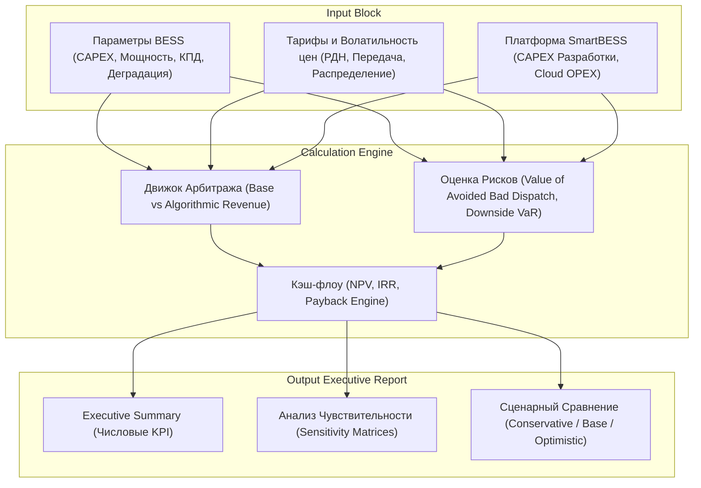
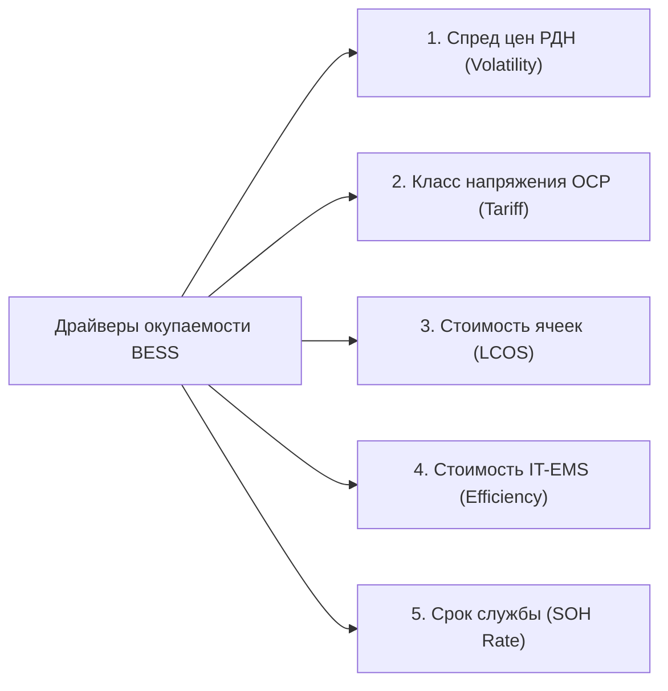

# Финансовая модель внедрения BESS и платформы SmartBESS Analytics
## Автор: Financial Analyst & Energy Investment Advisor
## Целевая аудитория: CFO (Финансовый директор) / Члены Правления

---

## 1. Структура финансовой модели (Model Structure)

Финансовая модель оценки BESS-проекта строится по модульному принципу в виде трех взаимосвязанных блоков:

### Разделы модели:
1.  **Block 1: CAPEX & OPEX Structure**: Разделение капитальных затрат на оборудование и IT-разработку, а также операционных затрат на обслуживание и облачную инфраструктуру.
2.  **Block 2: Operations & Revenue Generation**:
    *   *Dumb Dispatch (Простое эвристическое управление)*: Работа по фиксированному таймеру (заряд ночью, разряд в фиксированный вечерний пик).
    *   *Algorithmic Dispatch (Управление SmartBESS)*: Динамическая оптимизация по прогнозу LightGBM и MILP с учетом тарифов и стоимости деградации ячеек.
3.  **Block 3: Risk & Value of Forecasting**: Количественная оценка "ценности точного прогнозирования ВИЭ/цен" и "убытков от неверных диспетчерских команд".
4.  **Block 4: Cash Flows & Financial Metrics**: Расчет NPV, IRR, ROI и сроков окупаемости.

---

## 2. Формулы расчета (Calculations)

### 2.1. Полный CAPEX проекта ($CAPEX_{total}$)
$$CAPEX_{total} = CAPEX_{BESS} + CAPEX_{EMS}$$
*   $CAPEX_{BESS}$ — Закупка BESS контейнера, инвертора, СМР и подключение к сети (UAH).
*   $CAPEX_{EMS}$ — Стоимость разработки и внедрения аналитической EMS платформы (UAH).

### 2.2. Операционные расходы ($OPEX_t$)
$$OPEX_t = OPEX_{BESS, t} + OPEX_{EMS, t}$$
*   $OPEX_{BESS, t}$ — Страхование, физическая охрана, техническое обслуживание BESS (обычно $1.5\% - 2.0\%$ от $CAPEX_{BESS}$ в год).
*   $OPEX_{EMS, t}$ — Лицензия на ПО, облачные сервера (AWS/Azure/GCP), API погоды, техподдержка (UAH/год).

### 2.3. Экономический эффект алгоритмического управления ($\Delta Revenue_t$)
Платформа генерирует дополнительный доход за счет точной подстройки под ценовые колебания по сравнению с простым таймером:
$$\Delta Revenue_t = Revenue_{algorithmic, t} - Revenue_{dumb, t}$$

### 2.4. Value of Better Forecasting (Ценность прогнозирования - $VBF$)
Экономия от предотвращения ошибок прогнозирования (например, когда "простой" алгоритм заряжает батарею в часы дневного профицита, но из-за внезапной облачности цены на РДН не падают, а растут):
$$VBF = \sum_{d=1}^{365} \left( Profit_{optimal, d} - Profit_{error\_forecast, d} \right)$$
где $Profit_{error\_forecast}$ — прибыль BESS, если бы мы управляли ею на основе ошибочного прогноза (без учета реальных погодных факторов).

### 2.5. Value of Avoided Bad Dispatch Decisions ($VABDD$)
Устранение прямых убытков от команд, которые вызывают избыточную деградацию батареи (когда стоимость износа ячеек выше, чем разница цен покупки/продажи электроэнергии с учетом тарифов сети):
$$VABDD = \sum_{h=1}^{8760} \max \left( 0, C_{deg} - (P_{sell, h} - P_{buy, h}) \right) \cdot y_{h, dumb}$$

### 2.6. Чистый денежный поток за год ($CF_t$)
$$CF_t = (Revenue_{dumb, t} + \Delta Revenue_t) - OPEX_t$$

### 2.7. Финансовые метрики (NPV, IRR)
*   **NPV (Чистый дисконтированный доход)**:
    $$NPV = \sum_{t=1}^{N} \frac{CF_t}{(1 + r)^t} - CAPEX_{total}$$
    где $r$ — ставка дисконтирования (WACC компании, для Украины $\approx 12\% - 15\%$).
*   **IRR (Внутренняя норма доходности)**:
    Значение ставки дисконтирования $r$, при которой $NPV = 0$:
    $$\sum_{t=1}^{N} \frac{CF_t}{(1 + IRR)^t} - CAPEX_{total} = 0$$

---

## 3. Список драйверов окупаемости (Payback Drivers)

Для CFO окупаемость BESS проекта определяется 5 ключевыми факторами:

1.  **Суточная волатильность цен РДН**: Максимальная разница между дневным минимумом (солнечный профицит) и вечерним пиком. Чем выше спред, тем выше доход от каждого цикла.
2.  **Класс напряжения подключения (ОСР)**: Для 2-го класса напряжения тариф на распределение Облэнерго выше на $\approx 800 - 1000$ грн/МВт·ч, что увеличивает затраты на заряд Behind-the-Meter (BTM). Подключение по 1-му классу более выгодно для окупаемости.
3.  **Удельная стоимость деградации ($C_{deg}$)**: Определяется качеством ячеек (LFP/NMC) и условиями охлаждения. Снижение стоимости деградации позволяет делать $> 1.5$ циклов в сутки без угрозы быстрой потери емкости.
4.  **Точность ML-прогноза (WAPE)**: Снижение ошибки прогноза цен с $15\%$ до $6\%$ предотвращает ложные циклы заряда в дорогие часы и упущенную выгоду.
5.  **Срок службы BESS (SOH)**: Количество гарантированных циклов до потери $20\%$ емкости (обычно $6000$ циклов для LFP).

---

## 4. Сценарии окупаемости (Scenarios)

| Параметр / Метрика | Conservative (Консервативный) | Base (Базовый) | Optimistic (Агрессивный) |
| :--- | :--- | :--- | :--- |
| **Спред цен РДН (средний)** | 3500 грн/МВт·ч | 4800 грн/МВт·ч | 6200 грн/МВт·ч |
| **Количество циклов в день**| 1.0 цикл/день | 1.2 цикла/день | 1.6 цикла/день |
| **Точность прогноза (WAPE)** | 15.0% (высокие риски) | 7.5% (SmartBESS) | 5.0% (идеальные условия) |
| **Тарифный класс объекта** | 2 класс (Дорогой распредел)| 1 класс (Дешевый распредел)| BTM (замещение лимитов) |
| **Срок жизни BESS** | 8 лет | 10 лет | 12 лет |
| **Срок окупаемости** | **6.8 года** | **4.2 года** | **2.9 года** |

---

## 5. Executive Summary: Пример расчета в цифрах

Ниже приведен финансовый кейс для внедрения BESS мощностью **1 МВт / емкостью 1 МВт·ч** на промышленном предприятии в Киевской области (подключение по 1-му классу напряжения к сетям ДТЕК Киевские региональные электросети).

### 5.1. Капитальные и операционные затраты (Capex/Opex)
*   **CAPEX BESS (Железо + Монтаж)**: $350,000 USD $\times$ 40 = **$14,000,000$ UAH**.
*   **CAPEX EMS (IT-Платформа SmartBESS)**: **$1,200,000$ UAH** (разово).
*   **Итого CAPEX**: **$15,200,000$ UAH**.
*   **Ежегодный OPEX BESS**: **$210,000$ UAH/год** (1.5% от Capex).
*   **Ежегодный OPEX EMS (Сервера + API)**: **$180,000$ UAH/год**.
*   **Итого OPEX**: **$390,000$ UAH/год**.

### 5.2. Финансовые метрики эффективности

*   **Базовый доход от разряда (Dumb Fixed Schedule)**:
    *   1 цикл в день, средний спред $2.80$ грн/кВт·ч.
    *   $365 \times 1000 \text{ кВт·ч} \times 2.80 \text{ грн} = 1,022,000$ грн/год.
*   **Добавочный доход от SmartBESS (Algorithmic Dispatch)**:
    *   1.2 цикла в день, динамический выбор оптимальных пиков, средний эффективный спред $4.20$ грн/кВт·ч.
    *   $365 \times 1000 \text{ кВт·ч} \times 1.2 \times 4.20 \text{ грн} = 1,839,600$ грн/год.
    *   **Прирост доходности за счет алгоритмов**: **$+817,600$ UAH/год (+80%)**.
*   **Avoided Bad Dispatch (Предотвращенный износ)**:
    *   Алгоритм отменил 45 циклов в периоды аномально низкого спреда цен, сэкономив **$54,000$ UAH/год** амортизационного ресурса ячеек.
*   **Денежные потоки (Net Cash Flow)**:
    *   $CF_{year} = 1,839,600 - 390,000 = \mathbf{1,449,600}$ **UAH/год**.

### 5.3. Итоговые показатели окупаемости (при $r = 12\%$, Срок = 10 лет)
*   **NPV (Чистая приведенная стоимость)**: **$+6,478,325.52$ UAH** (проект высокорентабельный).
*   **IRR (Внутренняя норма доходности)**: **$26.58\%$** (намного выше стоимости капитала).
*   **Простой период окупаемости (Simple Payback)**: **$3.3$ года**.
*   **Дисконтированный период окупаемости (Discounted Payback)**: **$4.5$ года**.
*   **ROI (Окупаемость инвестиций)**: **$201\%$**.

---

## 6. Анализ чувствительности (Sensitivity Analysis)

Матрица чувствительности показывает, как изменится **NPV проекта (млн грн)** при одновременном изменении стоимости оборудования (CAPEX) и суточного спреда цен на РДН:

| CAPEX BESS / Спред цен РДН | -20% CAPEX (11.2 млн) | Базовый CAPEX (14.0 млн) | +20% CAPEX (16.8 млн) |
| :--- | :---: | :---: | :---: |
| **-20% Спред (3.36 грн/кВт·ч)** | +4.1 млн грн | +1.3 млн грн | -1.5 млн грн |
| **Базовый Спред (4.20 грн/кВт·ч)**| **+9.2 млн грн** | **+6.48 млн грн** | **+3.6 млн грн** |
| **+20% Спред (5.04 грн/кВт·ч)** | +14.4 млн грн | +11.6 млн грн | +8.8 млн грн |

> [!IMPORTANT]
> **Красная зона (NPV < 0)** возникает только при одновременном росте CAPEX оборудования на 20% и падении волатильности цен РДН на 20%. Внедрение алгоритмов SmartBESS защищает проект от ухода в красную зону за счет поддержания маржинальности даже на сжимающемся рынке.

---

## 7. Входные допущения пользователя (User Assumptions)

Для адаптации финансовой модели под конкретное промышленное предприятие пользователь должен задать следующие параметры:

1.  **Технические допущения BESS**:
    *   Номинальная мощность BESS (кВт) и емкость (кВт·ч).
    *   КПД цикла (Round-trip efficiency, %).
    *   Гарантированное число циклов до падения SOH до 80% (стандарт LFP: 6000 циклов).
2.  **Финансовые допущения**:
    *   Стоимость закупки BESS ($/кВт·ч) и курс USD/UAH.
    *   Ставка дисконтирования предприятия (WACC, %).
    *   Стоимость IT-разработки EMS платформы (грн).
3.  **Рыночные и тарифные допущения**:
    *   Название текущего Облэнерго (ОСР).
    *   Класс напряжения на границе балансовой принадлежности (1 или 2).
    *   Величина маржи текущего энергопоставщика (грн/МВт·ч).
