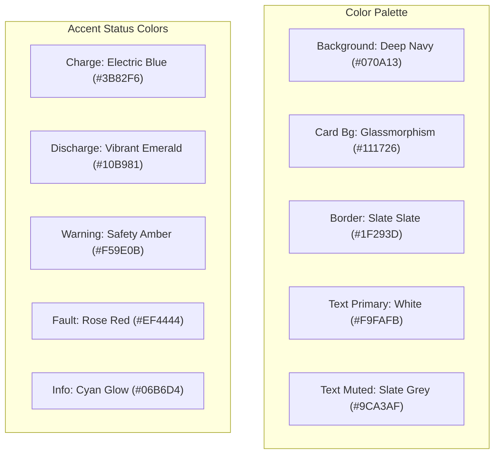

# Дизайн-спецификация веб-интерфейса (UI/UX & Frontend Spec) SmartBESS Analytics
## Авторы: Staff Product Designer & Senior Frontend Architect

---

## 1. Дизайн-система и визуальный язык (Visual Design System)

Для платформы SmartBESS выбран **Premium Industrial Dark Mode** дизайн. Он минимизирует усталость глаз диспетчеров при круглосуточном мониторинге и подчеркивает технологическую зрелость платформы (в стиле систем управления Tesla Autobidder, Bloomberg Terminal и Grafana Enterprise).



### 1.1. Цветовая палитра (Color Palette)
*   **Фон интерфейса (Background)**: `#070A13` (глубокий темный оттенок серо-синего).
*   **Карточки и панели (Card Background)**: `#111726` с размытием заднего плана (`backdrop-filter: blur(12px)`) и тонкой границей (`border: 1px solid #1F293D`).
*   **Шрифты**:
    *   Основной: `Inter` или `IBM Plex Sans` (высокая разборчивость цифр).
    *   Моноширинный (для телеметрии и логов): `JetBrains Mono` или `SF Mono`.
*   **Индикаторы состояния**:
    *   Заряд: `#3B82F6` (Electric Blue)
    *   Разряд: `#10B981` (Vibrant Emerald)
    *   Аварии / Ошибки: `#EF4444` (Rose Red)
    *   Предупреждения: `#F59E0B` (Safety Amber)

---

## 2. Информационная архитектура (IA) и навигация

Система использует **двухуровневую иерархию навигации**:

1.  **Sidebar (Глобальное меню)**: Закрепленная слева вертикальная панель. Разделяет экраны на **Управленческие (Executive)**, **Аналитические (Analytics)** и **Инженерные (Operations)**.
2.  **Top Header (Панель управления сессией)**:
    *   Быстрый переключатель BESS-активов (Asset Dropdown).
    *   Индикатор связи со SCADA (Modbus Heartbeat: зеленый/красный).
    *   Переключатель валюты (UAH / EUR).
    *   Badge текущей роли пользователя (Администратор, Диспетчер, Viewer).

```text
[Sidebar Menu]
├── EXECUTIVE LEVEL (Для CEO/CFO)
│   ├── 1. Executive Overview       # Глобальный финансовый дашборд
│   └── 5. ROI & Payback            # Инвестиционный калькулятор
├── ANALYTICAL LEVEL (Для Трейдеров)
│   ├── 3. Price Forecast           # Кривые РДН и метео
│   ├── 6. Risk Scenarios           # Стресс-моделирование и VaR
│   └── 8. Model Decisions & Audit  # Оценка качества ML (WAPE, Feature Importance)
└── OPERATIONAL LEVEL (Для Инженеров)
    ├── 2. Asset Detail             # Телеметрия BESS в реальном времени
    ├── 4. Optimization Schedule    # Текущие планы заряда/разряда
    └── 7. Settings & Tariffs       # Настройки ОСР и батареи
```

---

## 3. Детальная структура экранов дашборда

### Экран 1. Executive Overview (Управленческая сводка)
*   **Цель**: Дать CFO/CEO моментальную оценку доходности портфеля BESS.
*   **KPI Карточки**:
    *   *Чистая прибыль за период* (грн) с индикатором дельты к прошлому периоду.
    *   *Сэкономленные затраты* (грн) для BTM систем.
    *   *Эквивалентные циклы* (шт) и износ SOH.
*   **График 1**: Накопительный финансовый результат (P&L Cumulative Area Chart). По оси X — дни месяца, по оси Y — прибыль в грн.
*   **Таблица**: Список BESS активов с сортировкой по доходности, текущему статусу связи и SoC.

### Экран 2. Asset Detail (Карточка объекта и телеметрия)
*   **Цель**: Оперативный мониторинг инженером физического состояния конкретной батареи.
*   **Панель SCADA (Live Telemetry)**:
    *   Виджет "Battery SoC" в виде светящегося радиального прогресс-бара.
    *   Показатели: Температура ячеек ($^\circ\text{C}$), ток (А), напряжение (В), SOH (%).
*   **График 2**: Совмещенный суточный график телеметрии. По оси Y1 — активная мощность (заряд/разряд в кВт, столбчатая диаграмма), по оси Y2 — SoC (линия, %).
*   **Аварийное табло**: Лента последних событий SCADA (ошибки связи, перегрев).

### Экран 3. Price Forecast (Прогноз цен)
*   **Цель**: Анализ цен РДН трейдером.
*   **Фильтры**: Выбор модели прогнозирования (LightGBM, XGBoost, MLP), выбор даты.
*   **График 3 (Dual-Axis Forecast Chart)**:
    *   *Линия*: Базовый прогноз цены РДН (UAH/MWh).
    *   *Полупрозрачная область*: Доверительные интервалы (10% и 90% квантили).
    *   *Пунктирная линия*: Фактическая цена РДН (если дата историческая).
*   **Таблица**: Почасовые цены прогноза с цветовой маркировкой зон (самые дешевые часы — синий градиент, дорогие пики — красный градиент).

### Экран 4. Optimization Schedule (Суточное расписание)
*   **Цель**: Утверждение и ручная корректировка расписания диспетчером.
*   **Управление**: Переключатель режимов: **Автоматический EMS** (Модели РДН управляют Modbus напрямую) или **Ручной байпас** (Manual Override).
*   **График 4 (Interactive BESS Schedule)**:
    *   Интерактивная диаграмма Gantt/Bar, где пользователь может перетаскивать (Drag-and-Drop) высоту столбцов мощности для ручной корректировки заряда/разряда.
*   **Кнопка**: `Отправить расписание в SCADA` (с модальным окном подтверждения).

### Экран 5. ROI & Payback (Экономика проекта)
*   **Цель**: Оценка инвестиционной привлекательности новых инсталляций BESS.
*   **Панель ввода**: Слайдеры CAPEX (грн/кВт·ч), стоимость деградации, ставка дисконтирования (%), срок жизни проекта.
*   **График 5**: График накопленного дисконтированного денежного потока (Cumulative NPV Discounted Curve). Показывает точку пересечения оси нуля (Payback point).
*   **KPI выводы**: Срок окупаемости (Simple/Discounted), NPV (грн), IRR (%).

### Экран 6. Risk Scenarios (Сценарное моделирование)
*   **Цель**: Оценка финансовой устойчивости при рыночных катаклизмах.
*   **Селектор сценариев**: "Базовый", "Пессимистический (Военный дефицит)", "Агрессивный (Высокая волатильность)".
*   **График 6**: Сравнение P&L по сценариям (Multi-line Chart). Три кривые прибыли за месяц, наложенные друг на друга.
*   **Метрика VaR**: Карточка Value at Risk (95% и 99% доверительные уровни).

### Экран 7. Settings & Tariffs (Справочники)
*   **Цель**: Настройка параметров тарификации.
*   **Вкладки**:
    *   *Тарифы Облэнерго*: Выбор ОСР (ДТЕК, Львивобленерго и т.д.), класса напряжения (1 или 2), ввод маржи поставщика.
    *   *Параметры BESS*: Ввод емкости ячеек, КПД, деградационных штрафов.

### Экран 8. Audit / Model Decisions (Аудит решений)
*   **Цель**: Прозрачность работы алгоритмов ИИ для регуляторов и руководства.
*   **График 7**: Важность факторов прогноза (Feature Importance Bar Chart). Показывает, насколько сильно температура, облачность или день недели повлияли на прогноз цен.
*   **Метрики качества**: Вывод WAPE (%) и MAE (грн) работы моделей за последнюю неделю.
*   **Таблица**: Журнал ручных вмешательств операторов в автоматическую работу EMS.

---

## 4. Спецификация UI-компонентов и графиков (Charts & Controls)

Для построения интерактивных графиков на фронтенде рекомендуется библиотека **Recharts** (React) или **ApexCharts.js** благодаря их высокой производительности при рендере в реальном времени.

### 4.1. Сводная таблица требований к графикам

| Экран | Тип графика | Ось X | Ось Y | Элементы легенды / Интерактив |
| :--- | :--- | :--- | :--- | :--- |
| **Executive** | Cumulative Area | Дни периода | UAH (Прибыль) | Накопительный финансовый результат с выделением месяцев |
| **Asset Detail**| Mixed (Bar + Line) | Часы (0-23) | Y1: kW, Y2: SoC % | Столбцы заряда (синие), разряда (зеленые), линия SoC (желтая) |
| **Forecast** | Line with Shaded Area| Часы (0-23) | UAH/MWh | Линия прогноза РДН, заливка доверительного интервала 95% |
| **ROI** | Step Line Chart | Года (1-15) | UAH (NPV) | Линия окупаемости, маркер точки окупаемости (Break-even) |
| **Risk Scenarios**| Multi-line Chart | Дни | UAH (P&L) | 3 линии сравнения прибыли (Base / Pessimistic / Aggressive) |

---

## 5. Обработка критических состояний (Alert & Empty States)

### 5.1. SCADA Alarm System (Красная зона)
*   При выходе параметров батареи за критические рамки (например, Температура ячеек $> 55^\circ\text{C}$ или статус связи Modbus = `offline`) в верхней части дашборда появляется **Sticky Notification Banner** красного цвета с пульсацией.
*   Все виджеты на экране `Asset Detail` переходят в режим ограниченного отображения (полупрозрачные значения, восклицательные знаки).

### 5.2. Empty States (Нет данных)
*   *Сценарий*: Модель LightGBM еще не была обучена при первом запуске системы.
*   *Отображение*: Вместо пустого графика цен РДН выводится стилизованная иллюстрация неактивной модели с кнопкой быстрого действия:
    > **"Модель прогнозирования не обучена"**
    > *Для отображения прогнозов и построения суточного расписания BESS необходимо обучить LightGBM на исторических данных.*
    > `[ Обучить модель сейчас ]` (кнопка вызывает триггер `/api/retrain`)

### 5.3. Сетевой сбой (No Internet / SCADA Timeout)
*   При потере связи с сервером накладывается полупрозрачный темный экран (Overlay) с индикатором `Reconnecting to SmartBESS server...` и обратным отсчетом таймера повторной попытки.
