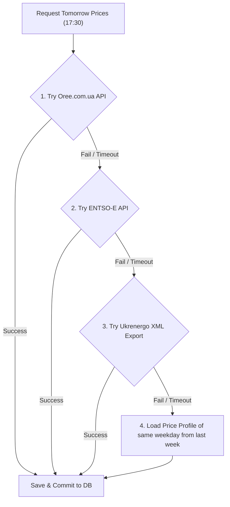

# Спецификация интеграции и слоя сбора данных (Data Ingestion & Integration Spec)
## Автор: Senior Integration Engineer
## Проект: SmartBESS Analytics Platform

---

## 1. Архитектура конвейера сбора данных (Ingestion Pipeline Architecture)

Для обеспечения высокой отказоустойчивости, отслеживаемости (data lineage) и масштабируемости слоя сбора данных внедряется **медальонная архитектура (Medallion Architecture)** на базе S3 Object Storage и PostgreSQL/TimescaleDB:

```mermaid
graph TD
    subgraph Data Sources
        Oree["ORE (oree.com.ua) - DAM Prices"]
        Entsoe["ENTSO-E (Mirror Prices)"]
        OpenMeteo["Open-Meteo API"]
        Nerc["NKREKP (Tariffs HTML/PDF)"]
        Uploads["User Excel/CSV Uploads"]
    end

    subgraph BRONZE LAYER (Raw S3 Bucket)
        S3_Raw["Raw Files: JSON, XML, HTML, CSV"]
    end

    subgraph SILVER LAYER (Normalized Staging)
        Staging_DB[("TimescaleDB / PostgreSQL (Staging)")]
        Parser["Parser Workers (JSON/HTML to Relational)"]
        Validator["Pydantic Data Validator"]
    end

    subgraph GOLD LAYER (Trusted Analytical)
        Timeseries_DB[("TimescaleDB (Trusted Hypertables)")]
        Feature_Store["Feature Store (ML ready)"]
    end

    Oree & Entsoe & OpenMeteo & Nerc & Uploads --> |Ingestion Tasks| S3_Raw
    S3_Raw --> Parser
    Parser --> Validator
    Validator --> |Cleaned & Imputed| Staging_DB
    Staging_DB --> |Aggregated & Enriched| Timeseries_DB & Feature_Store
```

### Спецификация слоев хранения:
1.  **Bronze Layer (Raw)**: 
    *   *Хранилище*: MinIO (локально) / AWS S3 (облако).
    *   *Формат*: Неизменяемые (immutable) файлы в исходном формате (`.json`, `.html`, `.xml`, `.csv`).
    *   *Структура путей*: `s3://smartbess-bronze/{source}/{year}/{month}/{day}/{timestamp}_{uuid}.[ext]`
2.  **Silver Layer (Normalized)**:
    *   *Хранилище*: Временные таблицы (Staging) в PostgreSQL/TimescaleDB.
    *   *Формат*: Реляционные строки с унифицированными типами данных. Время приводится к UTC. Выполняется дедупликация по первичному ключу `(timestamp, source_id)`.
3.  **Gold Layer (Trusted)**:
    *   *Хранилище*: Аналитические гипертаблицы TimescaleDB.
    *   *Формат*: Готовые очищенные временные ряды без пропусков (с заполнением дыр по методу forward-fill/линейной интерполяции). Готовы для ML-инференса и MILP-оптимизатора.

---

## 2. requests vs Playwright: Выбор технологии парсинга

Парсинг украинских государственных энергетических ресурсов требует комбинированного подхода из-за различий в их технологическом стеке.

| Критерий | Requests (HTTP Client) | Playwright (Headless Browser) |
| :--- | :--- | :--- |
| **Скорость выполнения** | Экстремально высокая (миллисекунды). | Средняя/Низкая (требует инициализации браузера). |
| **Потребление ресурсов** | Минимальное (~10-20 MB RAM на поток). | Высокое (~150-300 MB RAM на инстанс). |
| **Динамический JS / SPA**| Нет. Не выполняет JS-скрипты. | Полная поддержка (выполняет React, Vue, Angular). |
| **Анти-бот (Cloudflare)** | Легко блокируется. | Успешно обходит с помощью плагина `stealth`. |
| **ASP.NET ViewState** | Требует сложной эмуляции сессий. | Автоматически отрабатывает клики по формам. |

### Рекомендации по использованию в SmartBESS:

1.  **Requests (Fast Ingestion)**:
    *   *Где*: Open-Meteo API, ENTSO-E Transparency API, API «Оператора Рынка» (если доступно напрямую).
    *   *Почему*: Максимальная скорость работы и минимальная нагрузка на планировщик.
2.  **Playwright (Headless Browser Scraping)**:
    *   *Где*: Сайт НКРЕКП (поиск постановлений по тарифам в динамических таблицах), старый портал Оператора Рынка (если API заблокировано или защищено Cloudflare/CAPTCHA).
    *   *Интеграция*: Запуск в Docker-контейнере через пул воркеров Celery, изолированный от основного веб-сервера.

---

## 3. Стратегии отказоустойчивости (Anti-Fragile & Fallback Strategy)

Для предотвращения падения EMS при сбоях внешних API закладывается многоуровневая система резервирования:



1.  **Retry Policy (Экспоненциальная задержка с джиттером)**:
    При сетевой ошибке Celery-задача перезапускается по формуле:
    $$T_{wait} = 2^{attempt} \times 10 \text{ сек} + \text{random}(0, 5) \text{ сек}$$
    Максимальное число попыток: 5.
2.  **Circuit Breaker (Предохранитель)**:
    Если внешний сервис погоды возвращает ошибку 503 в течение 10 последовательных запросов, предохранитель переходит в состояние **Open**. Запросы к нему блокируются на 15 минут, а система сразу читает данные из резервного источника (Open-Meteo), снижая задержки API.
3.  **Stale Cache Fallback**:
    Если ни один источник цен РДН не ответил до 18:00, система берет цены **аналогичного дня недели за прошлую неделю** из исторического архива в БД в качестве цен РДН на завтра. Это позволяет оптимизатору BESS выдать график, пусть и субклинический, но предотвращающий остановку работы батареи.

---

## 4. Кэширование и дедупликация (Caching & Deduplication)

*   **Кэширование сырых ответов**: Все HTTP-ответы кэшируются в Redis с ключом-хэшем от URL и параметров. Это предотвращает повторные запросы к внешним API при множественных перезапусках задач.
*   **Идемпотентность на уровне БД**: Использование SQL-конструкции `ON CONFLICT (timestamp, area) DO UPDATE` (Upsert). Если мы скачали цены за 09.07.2026 повторно, база обновит существующие записи, исключая дублирование строк во временных рядах TimescaleDB.

---

## 5. Валидация загружаемых данных (Data Validation)

Для проверки качества спарсенных данных или файлов, загруженных пользователем через Excel/CSV, используется валидация на уровне **Pydantic**:

```python
from pydantic import BaseModel, Field, validator
from datetime import datetime

class MarketPriceRecord(BaseModel):
    timestamp: datetime
    price_uah: float = Field(..., ge=10.0, le=16000.0) # В пределах ценового ограничения НКРЕКП (price caps)
    area: str = Field(default="UA_IPS")

    @validator('timestamp')
    def check_not_in_future(cls, v):
        max_future = datetime.utcnow() + datetime.timedelta(days=2)
        if v > max_future:
            raise ValueError("Временная метка не может быть больше текущей даты + 2 дня.")
        return v
```

### Логика обработки аномалий:
*   **Удаление дубликатов**: Сортировка по времени создания и выбор самой свежей записи.
*   **Заполнение пропусков (Imputation)**: Если в ряду пропущено $\le 3$ часов, применяется линейная интерполяция. Если пропущено $> 3$ часов, выполняется заполнение значениями аналогичного часа предыдущего дня.

---

## 6. Наблюдаемость и алармы (Observability & Alerts)

Для мониторинга здоровья слоев сбора данных внедряются метрики в формате **Prometheus**:

1.  `ingestion_job_status{source="oree", status="success|fail"}` — статус выполнения сбора данных.
2.  `ingestion_latency_seconds{source="openweather"}` — задержка ответа внешних API.
3.  `data_gaps_count{table="market_prices"}` — количество незаполненных часов в Gold-слое базы данных.

### Матрица информирования (Alert Matrix)
*   **Severity: WARN (Slack/Telegram)**:
    *   *Событие*: Ошибка 1-й и 2-й попыток сбора цен РДН в 17:30.
*   **Severity: ERROR (PagerDuty / СМС дежурному инженеру)**:
    *   *Событие*: Переход Circuit Breaker в состояние Open для критического источника (Цены РДН). Невозможность рассчитать суточное расписание BESS на завтра к 18:00.
