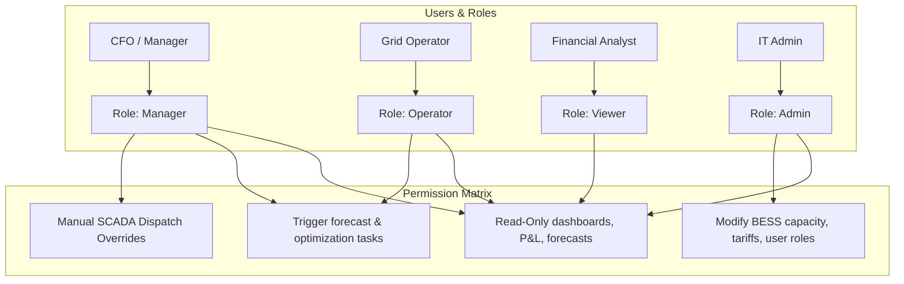
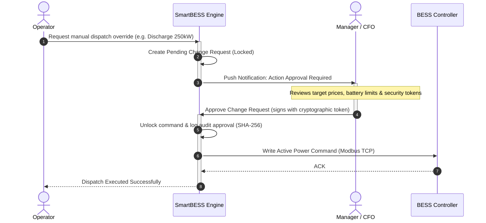

# Корпоративный стандарт безопасности (Enterprise Security Baseline)
## Автор: Enterprise Security Architect
## Проект: SmartBESS Analytics & EMS Platform

---

## 1. Ролевая модель доступа (Role-Based Access Control - RBAC)

Для разграничения доступа внутри платформы SmartBESS внедряется гранулярная модель RBAC. Аутентификация и авторизация осуществляются через стандарт **OAuth2 / OpenID Connect (OIDC)** с интеграцией корпоративного провайдера **Keycloak**.

### Матрица прав доступа к эндпоинтам:

| Роль | Чтение дашбордов и P&L | Запуск прогнозов и оптимизации | Ручные команды SCADA (Bypass) | Настройка лимитов BESS / Тарифов | Управление пользователями |
| :--- | :---: | :---: | :---: | :---: | :---: |
| **Viewer** | ✅ | ❌ | ❌ | ❌ | ❌ |
| **Operator** | ✅ | ✅ | ❌ | ❌ | ❌ |
| **Manager** | ✅ | ✅ | ✅ *(Требует 4-Eyes)* | ✅ | ❌ |
| **Admin** | ✅ | ❌ | ❌ | ✅ | ✅ |

---

## 2. Журнал аудита безопасности (Audit Logging)

Все действия пользователей, изменяющие состояние системы, и критические автоматические решения EMS записываются в неизменяемый лог аудита (`audit_logs`). 

### Структура записи лога аудита (Audit Schema)
Каждая запись содержит:
*   `timestamp`: Точное время в формате ISO 8601 (UTC).
*   `user_id` / `client_ip`: Идентификатор инициатора действия (пользователь или системный токен SCADA).
*   `action_type`: Тип события (`AUTH_LOGIN`, `MANUAL_DISPATCH_OVERRIDE`, `ASSET_LIMIT_CHANGE`, `MODEL_RETRAIN`, `TARIFF_UPDATE`).
*   `status`: Результат действия (`SUCCESS`, `DENIED`, `FAILED`).
*   `payload_diff`: Разница (diff) между старым и новым состоянием объекта в формате JSON.
*   `hash`: Криптографическая подпись записи (SHA-256 от полей записи + хэш предыдущей записи) для исключения подделки логов на уровне базы данных.

---

## 3. Управление секретами и ключами (Secrets Management)

*   **Запрет жесткого кодирования (No Hardcoded Secrets)**: Все ключи доступа (OpenWeather API, ENTSO-E, пароли к БД, секреты подписи JWT) запрещено хранить в репозитории кода.
*   **Хранилище секретов**: В продакшене используется специализированный менеджер секретов **HashiCorp Vault** (или AWS Secrets Manager). При запуске контейнеров секреты инжектируются в виде переменных окружения (Environment Variables) в память процесса.
*   **Ротация ключей**: Сервисные API-ключи внешних систем ротируются каждые 90 дней.

---

## 4. Шифрование данных (Data Encryption)

### 4.1. Данные в процессе передачи (Encryption in Transit)
*   Вся сетевая коммуникация защищается протоколом **TLS 1.3** (с откатом до TLS 1.2 для старого SCADA оборудования).
*   **HTTPS**: Использование заголовка `Strict-Transport-Security` (HSTS) для принудительного использования шифрованного соединения браузерами.
*   **SCADA Modbus TCP**: Базовый Modbus TCP не имеет шифрования. В продакшене трафик между EMS и BESS-контроллером должен заворачиваться в **IPSec VPN туннель** или передаваться по **Modbus TCP Security (TLS)**.

### 4.2. Данные в покое (Encryption at Rest)
*   **База данных**: Все разделы диска с базами данных TimescaleDB и кэшем Redis шифруются на уровне ОС с помощью технологии **LUKS** (Linux Unified Key Setup) или шифрования облачных дисков AES-256.
*   **Резервные копии**: Все бэкапы перед выгрузкой в S3 шифруются с помощью утилиты `gpg` с использованием асимметричного ключа шифрования организации.

---

## 5. Резервное копирование и восстановление (Backup & Disaster Recovery)

Для платформы SmartBESS устанавливаются следующие целевые показатели непрерывности бизнеса:
*   **RPO (Recovery Point Objective)** = 1 час (максимально допустимый объем утери данных при аварии).
*   **RTO (Recovery Time Objective)** = 4 часа (максимально допустимое время восстановления доступности платформы).

### Стратегия бэкапов:
*   **База данных РДН и телеметрии**: Почасовой инкрементальный бэкап транзакционных логов (WAL archiving) и ежедневный полный бэкап (pg_dump) в территориально удаленный S3-бакет.
*   **Redis Cache**: Не требует бэкапа (восстанавливается автоматически из базы PostgreSQL при запуске).
*   **Модели ML**: Веса обученных моделей LightGBM дублируются в S3-хранилище версий моделей (MLflow Model Registry).

---

## 6. Model Governance (Управление моделями и воспроизводимость)

Для предотвращения несанкционированного изменения логики ИИ и обеспечения полной аудируемости решений:
*   **Версионирование моделей**: Каждая обученная модель сохраняется с уникальным хэшем коммита Git и версией данных, на которых она обучалась.
*   **Воспроизводимость прогноза (Reproducibility)**: При сохранении прогноза цен в БД записывается точная версия модели (`model_version`) и случайное семя (`random_seed`), использованные при инференсе.
*   **Отслеживание дрейфа (Model Drift)**: Система раз в сутки вычисляет точность модели (WAPE). Если ошибка прогноза за последние 3 дня превышает $15\%$, система отправляет Alarm трейдеру для ручной проверки рынка и инициации переобучения.

---

## 7. Двухфакторное одобрение критических команд (Four-Eyes Principle Workflow)

Для защиты от ошибок операторов или компрометации их учетных записей, отправка критических команд на BESS защищается процессом **двойного подтверждения**:

---

## 8. DevSecOps Чек-лист для CI/CD пайплайна

При сборке и деплое приложения в продакшн CI/CD пайплайн (GitLab CI / GitHub Actions) должен автоматически выполнять следующие проверки:

1.  **SAST (Static Application Security Testing)**:
    *   Проверка Python-кода на уязвимости с помощью утилиты `bandit`.
    *   Анализ качества и безопасности кода с помощью `SonarQube`.
2.  **SCA (Software Composition Analysis)**:
    *   Проверка сторонних библиотек (requirements.txt) на известные уязвимости (CVE) с помощью `pip-audit` или `Snyk`.
3.  **Container Security**:
    *   Сканирование Docker-образов бэкенда на наличие уязвимостей в пакетах ОС с помощью `Trivy` перед деплоем в Kubernetes/Docker Swarm.
4.  **DAST (Dynamic Application Security Testing)**:
    *   Автоматическое сканирование запущенного тестового API с помощью `OWASP ZAP` на предмет XSS, SQL-инъекций и корректности CORS-настроек.
